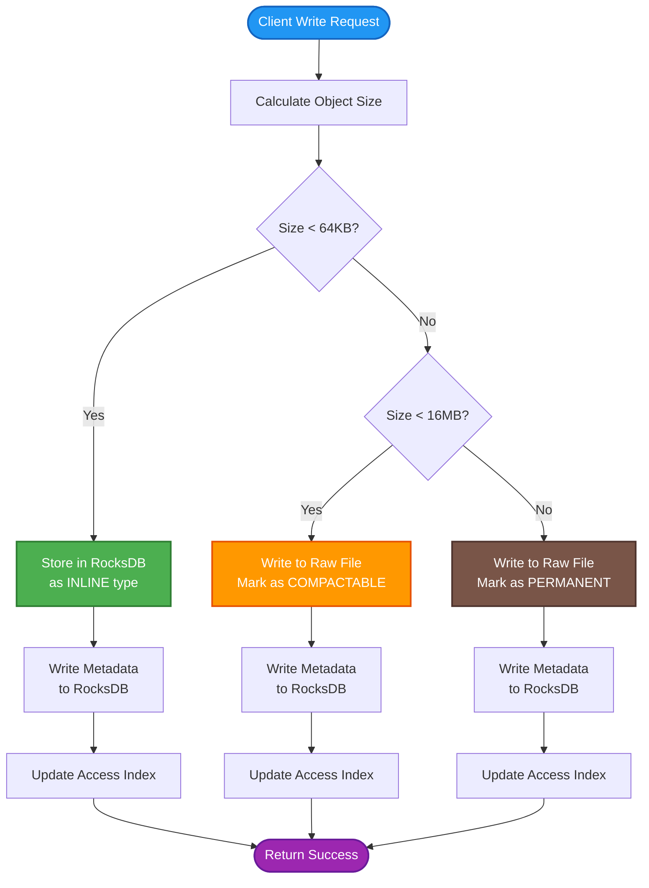
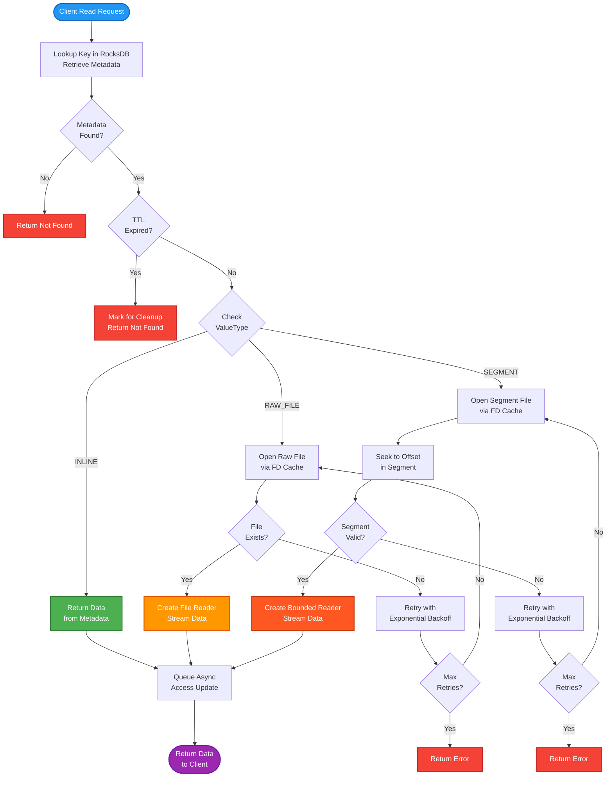
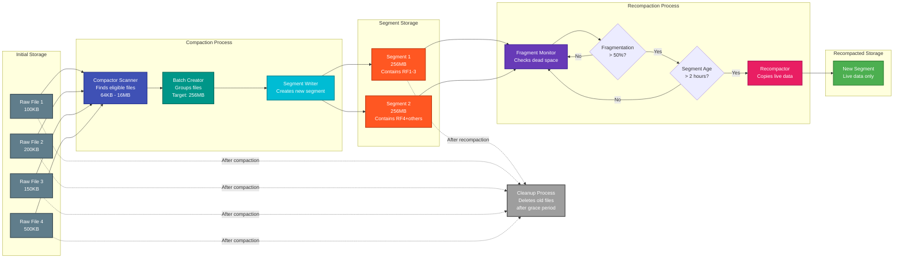

# RFC-001: Storage Architecture Overview

**RFC Number:** 001  
**Status:** Active  
**Authors:** Ovais Tariq
**Created:** 2025-06-05  
**Last Updated:** 2025-09-04

## Abstract

OCache implements a multi-tiered storage architecture that intelligently routes objects based on size to optimize for both performance and storage efficiency. The system uses RocksDB for small objects (metadata and inline storage), raw files for medium-to-large objects, and a segment-based storage system for compacted medium objects. This RFC describes the overall storage architecture, the rationale behind key design decisions, and how different components interact to provide a high-performance caching solution.

## Motivation

Modern caching workloads present diverse requirements:

- **Small objects** (< 64KB): Highly concurrent access where latency is critical, benefit from in-memory caching and fast key-value lookups
- **Medium objects** (64KB - 16MB): Moderate concurrency access patterns, benefit from consolidation to reduce file handle usage
- **Large objects** (> 16MB): Low concurrency with high throughput requirements, streaming capabilities, benefit from direct file access

Traditional single-tier storage systems force trade-offs that compromise performance for certain object sizes. OCache's architecture addresses these challenges by:

1. Optimizing I/O patterns for different object sizes
2. Providing predictable performance across the entire size spectrum
3. Supporting efficient TTL and LRU eviction at scale

## Design Overview

### Three-Tier Storage Model

#### Storage Tier Selection Flow

This flowchart shows how OCache determines the appropriate storage tier for incoming objects based on their size:



#### Client Read Request Flow

This flowchart shows how OCache retrieves objects from different storage tiers based on metadata:



#### Compaction and Recompaction Process

This diagram illustrates the background compaction and recompaction lifecycle for medium-sized objects:



### Key Components

1. **RocksDB Layer**: Stores all metadata and small objects inline
2. **File Manager**: Manages raw file creation, reading, and deletion
3. **Segment Manager**: Manages compacted segments with multiple objects
4. **Compactor**: Background process that migrates raw files to segments
5. **Cleaner**: Background process for TTL expiration and LRU eviction
6. **Access Updater**: Tracks object access patterns for LRU decisions

## Detailed Design

### Storage Routing Logic

The storage layer makes routing decisions based on object size:

```
FUNCTION routeObject(key, value):
    size = length(value)

    IF size < InlineThreshold:          // Default: 64KB
        // Small objects: optimize for high concurrency and low latency
        RETURN INLINE                    // Store in RocksDB

    ELSE IF size < CompactThreshold:    // Default: 16MB
        // Medium objects: balance between performance and resource usage
        RETURN RAW_FILE                  // Store as raw file, eligible for compaction

    ELSE:
        // Large objects: optimize for throughput with streaming
        RETURN RAW_FILE_PERMANENT        // Store as raw file, never compact
    END IF
END FUNCTION
```

### Metadata Structure

Every object, regardless of storage location, has metadata stored in RocksDB:

```protobuf
message ValueMessage {
  ValueType value_type = 1;    // INLINE, RAW_FILE, or SEGMENT
  bytes data = 2;               // Inline data (if applicable)
  int64 expiry = 3;             // TTL expiry timestamp
  string raw_file_path = 4;     // Path to raw file
  string segment_path = 5;      // Path to segment file
  int64 segment_offset = 6;     // Offset within segment
  int64 value_length = 7;       // Length of value
  uint32 checksum = 8;          // CRC32 checksum
}
```

### Write Path

1. **Size Classification**: Determine storage tier based on object size
2. **Metadata Creation**: Create ValueMessage with appropriate storage location
3. **Data Storage**:
   - **Inline**: Store data directly in RocksDB with metadata
   - **Raw File**: Write to new file, store path in metadata
   - **Segment**: Initially write to raw file (compaction handles migration)
4. **Atomic Commit**: Write metadata to RocksDB (ensures consistency)
5. **Access Tracking**: Update access index for LRU tracking

### Read Path

1. **Metadata Lookup**: Retrieve ValueMessage from RocksDB
2. **Data Retrieval** based on ValueType:
   - **Inline**: Return data from ValueMessage
   - **Raw File**: Open file using FD cache, return reader
   - **Segment**: Open segment, seek to offset, return bounded reader
3. **Access Update**: Queue asynchronous access time update
4. **Error Handling**: Retry with exponential backoff for transient errors

### Background Processes

#### Compactor

- Scans for raw files eligible for compaction (64KB - 16MB)
- Batches multiple files into segments (target: 256MB segments)
- Updates metadata atomically after successful compaction
- Deletes original raw files after grace period

#### Recompactor

- Monitors segment fragmentation (deleted space ratio)
- Triggers when fragmentation exceeds threshold (default: 50%)
- Copies live data to new segments
- Ensures segments are "cold" before recompaction (default: 2 hours old)

#### Cleaner

- Periodically scans for expired TTL entries
- Implements LRU eviction when disk usage exceeds threshold
- Cleans up orphaned files from failed operations
- Maintains access index buckets (24-hour granularity)

## Trade-offs and Alternatives

### Considered Alternatives

1. **Single-Tier File Storage**

   - Pros: Simpler implementation, uniform handling
   - Cons: Excessive file descriptors, poor small object performance
   - Decision: Rejected due to scalability limitations

2. **Pure LSM-Tree (RocksDB for everything)**

   - Pros: Proven technology, good write amplification
   - Cons: Large objects cause write amplification, compaction overhead
   - Decision: Rejected for large object inefficiency

3. **Fixed-Size Blocks**
   - Pros: Predictable I/O patterns, simple space management
   - Cons: Internal fragmentation, complex for variable sizes
   - Decision: Rejected for space inefficiency

### Design Trade-offs

1. **Inline Threshold (64KB)**

   - Lower: Less RocksDB memory usage, more files
   - Higher: Better small object performance, more memory usage
   - Choice: 64KB balances memory and file descriptor usage

2. **Compaction Threshold (16MB)**

   - Lower: More objects compacted, better FD usage
   - Higher: Less compaction overhead, simpler large objects
   - Choice: 16MB prevents excessive segment churn

3. **Segment Size (256MB)**
   - Smaller: Faster compaction, more segments
   - Larger: Better sequential I/O, fewer segments
   - Choice: 256MB optimizes for modern SSD performance

## Performance Considerations

### Optimizations

1. **Read-Only Segments**: Immutable segments enable lock-free reads
2. **Buffer Pooling**: Reusable buffers reduce GC pressure
3. **Batch Operations**: Compaction and cleanup work in batches
4. **Async Access Updates**: Access tracking doesn't block reads
5. **File Descriptor Caching**: LRU cache with 10,000 entries prevents syscall overhead

## References

- [RocksDB Architecture](https://github.com/facebook/rocksdb/wiki/RocksDB-Overview)
- [Log-Structured Merge Trees](https://www.cs.umb.edu/~poneil/lsmtree.pdf)
