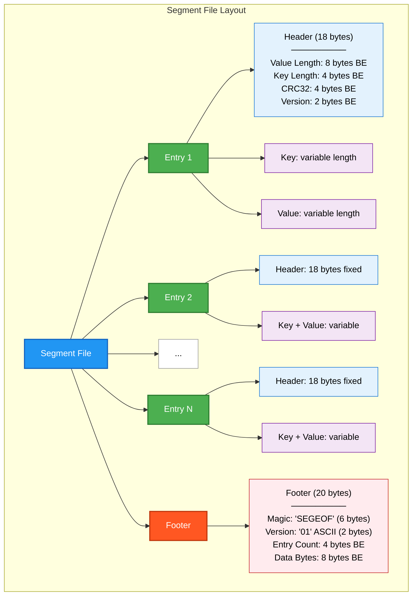

# RFC-002: Segment Storage Design

**RFC Number:** 002  
**Status:** Active  
**Authors:** Ovais Tariq  
**Created:** 2025-06-13  
**Last Updated:** 2025-09-10

## Abstract

This RFC describes the design and implementation of OCache's segment storage system, which consolidates multiple medium-sized objects into larger segment files to optimize file descriptor usage and I/O patterns. The segment system implements an append-only, write-once architecture with immutable segments that support concurrent reads, efficient space reclamation through recompaction, and robust error handling. This document details the segment format, lifecycle management, reservation system, and fragmentation tracking mechanisms.

## Motivation

Managing individual files for each cached object presents several challenges:

- **File Descriptor Exhaustion**: Systems have FD limits
- **Filesystem Overhead**: Each file incurs metadata overhead (inodes, directory entries)
- **I/O Inefficiency**: Small random I/Os are inefficient on both HDDs and SSDs
- **Cleanup Complexity**: Managing millions of small files is operationally complex

The segment storage system addresses these issues by:

1. Consolidating multiple objects into 256MB segments
2. Reducing file count by 100-1000x for medium objects
3. Enabling efficient sequential writes during compaction
4. Supporting atomic multi-object operations
5. Providing predictable space reclamation through recompaction

## Design Overview

### Design Decisions

1. **Append-Only vs. In-Place Updates**

   - Choice: Append-only for simplicity and crash consistency
   - Trade-off: Requires recompaction for space reclamation

2. **Fixed vs. Variable Segment Size**

   - Choice: Fixed maximum (256MB) with variable actual size
   - Trade-off: Some internal fragmentation vs. predictable I/O

3. **Embedded vs. External Index**
   - Choice: Metadata in RocksDB, no embedded index
   - Trade-off: Extra lookup vs. segment simplicity

### Segment File Format



### Resource Usage

- Memory: 100KB per active segment + FD cache
- File Descriptors: 1 per active segment + cached FDs
- Disk Space: < 1% overhead for headers
- CPU: Minimal (CRC32 calculation)

### Key Components

#### Key Data Structures

**Segment**: Represents a single segment file containing multiple key-value pairs. Tracks file path, current size, number of entries, total data bytes, format version, maximum supported size, and reservation status. Protected by read-write mutex for concurrent access.

**Manager**: Orchestrates all segment operations including creation, writing, reading, and deletion. Maintains segment registry, reservation tracking, FD cache for efficient file access, and file-level locking for consistency.

## Detailed Design

### Segment Lifecycle

#### 1. Creation Phase

Segments are created with unique names containing nanosecond timestamps and UUIDs to prevent collisions. Files are opened with exclusive access (O_CREATE|O_EXCL) to ensure atomicity. The segment starts empty (no magic header) and is ready to accept entries immediately. Pre-allocation may be used to reserve disk space and reduce fragmentation.

#### 2. Active Phase (Append-Only Writes)

During the active phase, segments accept sequential writes through the WriteEntry operation. Each entry consists of:

- **Header (18 bytes fixed)**: Value length (8B), key length (4B), CRC32 checksum (4B), header version (2B)
- **Key**: Variable-length key bytes
- **Value**: Variable-length value data

Writes are performed sequentially with the segment maintaining exclusive access through mutex locking. The write offset is returned for later retrieval. Segments track total size, entry count, and data bytes for monitoring and compaction decisions.

```
PROCEDURE WriteEntry(key, value_reader, metadata):
    header = BuildHeader(key, metadata.length, metadata.checksum, version)
    needed = HeaderSize + len(key) + metadata.length

    IF segment.size + needed > MaxSegmentSize:
        RETURN SegmentFull

    offset = segment.size
    WriteHeader(header)
    CopyValue(value_reader)

    UpdateStatistics(needed, metadata.length)
    RETURN offset
```

#### 3. Finalization Phase (Sealing)

When a segment reaches capacity or needs to be closed, it undergoes finalization:

1. **Footer Writing**: A 20-byte footer is appended containing:

   - Magic string "SEGEOF" (6 bytes) for validation
   - Version as ASCII ("01", "02", etc.) (2 bytes)
   - Total entry count (4 bytes)
   - Total data bytes (8 bytes)

2. **File Truncation**: Pre-allocated space is truncated to actual size
3. **Sync to Disk**: fsync() ensures durability
4. **File Closure**: Write handle is closed, segment becomes read-only
5. **Reservation Release**: Any active reservation is cleared

Once finalized, segments are immutable and accessed only for reads through the FD cache.

#### 4. Deletion Phase

Segment deletion follows a careful protocol to prevent data loss:

1. **Lock Check**: Verify no active readers hold locks
2. **Registry Removal**: Remove from manager's segment map
3. **File Closure**: Close any open file handles
4. **Physical Deletion**: Remove file from filesystem

Deletion typically occurs after:

- Successful recompaction (old segments replaced by new ones)
- LRU eviction under disk pressure
- Manual cleanup operations

A grace period ensures ongoing operations complete before deletion.

### Reservation System

The reservation system ensures exclusive access to segments during multi-step operations like compaction. Each segment can be reserved by a single caller identified by a unique ID (e.g., "compactor", "recompactor").

**Reservation Protocol**:

1. **Acquire**: Caller requests segment with their ID
2. **Check**: System verifies segment is available or already reserved by same caller
3. **Grant**: Segment marked as reserved, caller proceeds with operations
4. **Release**: Caller releases reservation when done or on error

**Key Properties**:

- Prevents concurrent writers to same segment
- Allows same caller to re-acquire reservation (idempotent)
- Automatically cleared on segment finalization
- New segments created if all existing segments are reserved

```
PROCEDURE ReserveSegment(callerID):
    IF current_segment exists AND has_space:
        IF not_reserved OR reserved_by(callerID):
            Mark reserved_by(callerID)
            RETURN current_segment

    new_segment = CreateNewSegment()
    Mark new_segment reserved_by(callerID)
    RETURN new_segment
```

### Read Operations

#### Single Object Read

Reading from segments involves:

1. **FD Cache Lookup**: Retrieve cached file descriptor or open file
2. **Read Lock Acquisition**: Prevent deletion during read
3. **Bounded Reading**: Create reader limited to value boundaries
4. **Cleanup on Close**: Release FD to cache and unlock

The FD cache significantly reduces open() syscall overhead for frequently accessed segments.

#### Iterator for Scanning

Iterators provide sequential access to all entries in a segment, used primarily during recompaction:

```
PROCEDURE IterateSegment(segment):
    position = 0
    WHILE position < segment_size - FooterSize:
        header = ReadHeader(position)
        entry = ExtractEntry(header)
        YIELD entry
        position += HeaderSize + entry.KeyLength + entry.ValueLength
```

Iterators maintain current position and handle EOF detection by checking against segment size minus footer.

### Fragmentation Tracking

Segments track deleted entries to enable intelligent recompaction decisions. When an object is deleted or updated, its space within the segment becomes dead space but cannot be reclaimed in-place due to the append-only design.

**Delete Index**: Maintained in RocksDB with per-segment statistics:

- Number of deleted entries
- Total deleted bytes
- Updated atomically via merge operators

**Fragmentation Calculation**:

```
Fragmentation = DeletedBytes / TotalDataBytes
```

Segments with high fragmentation (>50%) become candidates for recompaction, where live data is copied to new segments and old segments are deleted.

## Error Handling

### Corruption Detection

- CRC32 checksums on every value
- Magic footer prevents reading invalid files
- Version field enables format migration

### Recovery Mechanisms

Segment recovery handles various failure scenarios:

**Validation Steps**:

1. **Footer Verification**: Read last 20 bytes, check for "SEGEOF" magic
2. **Metadata Extraction**: Parse version, entry count, data bytes
3. **Consistency Check**: Validate file size matches expected size
4. **Entry Scanning**: Optionally iterate entries to verify checksums

**Recovery Strategies**:

- **Truncated Segments**: If footer is missing, scan entries to rebuild metadata
- **Corrupted Entries**: Skip corrupted entries, continue with valid ones
- **Version Mismatch**: Handle format migrations based on version field
- **Orphaned Segments**: Delete segments not referenced in metadata

```
PROCEDURE RecoverSegment(path):
    footer = ReadFooter(path)
    IF ValidateFooter(footer):
        metadata = ExtractMetadata(footer)
        RegisterSegment(path, metadata)
    ELSE:
        metadata = ScanAndRebuild(path)
        IF metadata.valid:
            RegisterSegment(path, metadata)
        ELSE:
            MarkForDeletion(path)
```

## Appendix: Key Algorithms

### Segment Selection for Compaction

```
FUNCTION SelectSegmentForRecompaction(segments):
    best_segment = NULL
    max_score = 0

    FOR EACH segment IN segments:
        IF Age(segment) < MinimumAge:  // Skip hot segments
            CONTINUE

        fragmentation = GetFragmentation(segment)
        age_hours = HoursSince(segment.created)
        size_gb = segment.dataBytes / (1024^3)

        // Score favors old, fragmented, smaller segments
        score = fragmentation * log(age_hours) * (1 / (1 + size_gb))

        IF score > max_score:
            max_score = score
            best_segment = segment

    RETURN best_segment
```

### Entry Header Construction

```
FUNCTION BuildEntryHeader(key, value_length, checksum, version):
    header = AllocateBytes(18 + len(key))

    // Fixed header (18 bytes)
    WriteBigEndian64(header[0:8], value_length)
    WriteBigEndian32(header[8:12], len(key))
    WriteBigEndian32(header[12:16], checksum)
    WriteBigEndian16(header[16:18], version)

    // Variable key
    CopyBytes(header[18:], key)

    RETURN header
```

## References

- [WiscKey: Separating Keys from Values](https://www.usenix.org/system/files/conference/fast16/fast16-papers-lu.pdf)
- [RocksDB BlobDB Design](https://github.com/facebook/rocksdb/wiki/BlobDB)
