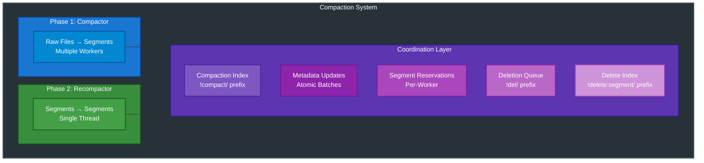

# RFC-003: Compaction System Design

**RFC Number:** 003  
**Status:** Active  
**Authors:** Ovais Tariq  
**Created:** 2025-07-11  
**Last Updated:** 2025-09-10

## Abstract

This RFC describes OCache's two-phase compaction system that migrates medium-sized objects from individual raw files to consolidated segments, and subsequently recompacts fragmented segments to reclaim space. The system operates as a background service with configurable parallelism, implementing careful coordination with the storage layer to ensure consistency while minimizing impact on foreground operations. The design emphasizes incremental progress, crash safety, and efficient resource utilization.

## Motivation

The compaction system addresses critical operational challenges:

1. **File Descriptor Pressure**: Individual files per object exhaust FD limits
2. **Filesystem Scalability**: Millions of files stress filesystem metadata operations
3. **Space Fragmentation**: Deleted objects leave holes in segments
4. **I/O Efficiency**: Small files result in inefficient random I/O patterns
5. **Operational Complexity**: Managing millions of files complicates backup/recovery

The two-phase approach provides:

- **Phase 1**: Raw file to segment migration (consolidation)
- **Phase 2**: Segment to segment recompaction (defragmentation)

## Design Overview

### System Architecture



### Key Components

**Compactor**: Manages raw file to segment migration with support for multiple parallel workers. Each worker processes a partition of the compaction index, acquires segment reservations independently, and performs batch metadata updates.

**SegmentRecompactor**: Handles defragmentation of segments with high dead space ratio. Monitors segment fragmentation levels, copies live data to new segments, and safely deletes old fragmented segments.

**Deletion Queue**: Centralized queue for safe file deletion with configurable grace period. Processes deletions in batches, handles both raw files and segments, and maintains statistics.

**Compaction Index**: Special RocksDB keyspace (`!compact/` prefix) tracking files eligible for compaction. Entries are added when raw files are created and removed after successful compaction.

**Configuration Parameters**:

- **MaxBytesPerRound**: Limits data processed per compaction cycle (default: 1GB)
- **CompactionThreads**: Number of parallel workers (default: 1, max: CPU cores)
- **FragmentationThreshold**: Trigger for segment recompaction (default: 0.5 = 50%)
- **MinSegmentAge**: Minimum age before recompaction (default: 2 hours)
- **MinSegments**: Minimum segments required for safe recompaction (default: 2)

## Detailed Design

### Phase 1: Raw File Compaction

#### Discovery and Selection

The compactor uses a dedicated compaction index to track files eligible for migration. This index uses the `!compact/` prefix with entries formatted as:

```
Key: !compact/<timestamp_nano>|<user_key>
Value: <file_path>
```

Files are added to this index when created and removed after successful compaction. The discovery process:

1. **Index Scanning**: Iterator seeks to `!compact/` prefix
2. **Metadata Validation**: For each entry, fetch user metadata to verify:
   - Object still exists (not deleted)
   - Still stored as RAW_FILE (not already compacted)
   - File path matches index (detect stale entries)
3. **Worker Partitioning**: Use hash-based partitioning of user keys to distribute work across threads
4. **Batch Limiting**: Process up to MaxBytesPerRound per cycle

```
PROCEDURE DiscoverCandidates(workerID):
    iterator = CreateIterator("!compact/")

    FOR EACH entry IN iterator:
        userKey, filePath = ParseCompactionEntry(entry)

        // Hash-based partitioning for this worker
        IF Hash(userKey) % NumWorkers != workerID:
            CONTINUE

        metadata = FetchMetadata(userKey)
        IF ValidateEntry(metadata, filePath):
            YIELD CompactionCandidate(userKey, filePath, metadata)
```

#### Parallel Processing

The compactor supports configurable parallelism through multiple worker threads. Each worker:

- Operates independently with its own iterator and write batch
- Acquires segment reservations using a unique worker ID
- Processes a hash-partitioned subset of the compaction index
- Handles errors gracefully without affecting other workers

**Work Distribution**: Hash-based partitioning ensures even distribution and prevents workers from competing for the same entries:

```
WorkerAssignment = Hash(UserKey) mod NumWorkers
```

**Resource Management**:

- Each worker maintains its own segment reservation
- Workers release reservations on completion or error
- Segment manager handles concurrent reservation requests
- Write batches are flushed periodically to limit memory usage

```
PROCEDURE ParallelCompaction(numWorkers):
    FOR workerID IN 0..numWorkers-1:
        SPAWN CompactionWorker(workerID)

    WAIT all workers complete
```

#### Migration Process

Each worker follows a careful protocol to migrate files to segments:

1. **Segment Acquisition**: Reserve segment with unique worker ID
2. **Entry Processing**: For each compaction index entry:
   - Validate metadata (check if still RAW_FILE)
   - Open raw file for reading
   - Write to segment using streaming copy
   - Update metadata to point to segment location
   - Queue original file for deletion
   - Remove compaction index entry
3. **Batch Updates**: Flush metadata updates periodically
4. **Segment Rotation**: When segment fills, finalize and acquire new one
5. **Error Handling**: Skip corrupted files, log errors, continue processing

**Error Recovery Strategies**:

- **Metadata Not Found**: Object deleted, remove index entry and queue file deletion
- **Already Compacted**: Remove stale index entry
- **File Missing**: Remove index entry and orphaned metadata
- **Checksum Mismatch**: Log corruption, skip file, continue
- **Segment Full**: Finalize current segment, acquire new one

```
PROCEDURE MigrateFile(entry, segment, writeBatch):
    metadata = FetchMetadata(entry.key)

    IF metadata.type != RAW_FILE:
        RemoveIndexEntry(entry.key)
        RETURN

    reader = OpenFile(entry.filePath)
    offset = segment.WriteEntry(entry.key, reader)

    IF successful:
        newMetadata = CreateSegmentMetadata(segment.path, offset)
        writeBatch.Put(entry.key, newMetadata)
        writeBatch.Delete(compactionIndexKey)
        deletionQueue.Add(entry.filePath)
```

### Phase 2: Segment Recompaction

#### Fragmentation Analysis

The recompactor analyzes segment fragmentation by examining deletion statistics maintained in RocksDB:

```
PROCEDURE AnalyzeFragmentation():
    candidates = []

    FOR EACH segment IN ListAllSegments():
        // Skip hot segments to avoid recompacting recently written data
        IF Age(segment) < MinimumAge:
            CONTINUE

        // Retrieve deletion statistics from delete index
        delete_stats = GetDeleteIndexEntry(segment.path)

        // Calculate fragmentation as ratio of dead to total space
        fragmentation = delete_stats.deleted_bytes / segment.data_bytes

        IF fragmentation >= FragmentationThreshold:
            candidate = {
                segment: segment,
                fragmentation: fragmentation,
                live_bytes: segment.data_bytes - delete_stats.deleted_bytes,
                dead_bytes: delete_stats.deleted_bytes
            }
            ADD candidate TO candidates

    // Prioritize most fragmented segments
    SORT candidates BY fragmentation DESCENDING

    RETURN candidates
```

**Key Considerations:**

- **Age Filter**: Segments must be "cold" (default: 2 hours old) to avoid recompacting actively accessed data
- **Delete Index**: Maintained via merge operators for atomic updates
- **Fragmentation Threshold**: Default 50% triggers recompaction
- **Prioritization**: Most fragmented segments are processed first to maximize space reclamation

#### Recompaction Process

The recompaction process consolidates live data from fragmented segments into new, densely-packed segments. This process runs periodically to reclaim space occupied by deleted entries within segments.

**Recompaction Strategy:**

The recompactor implements a multi-phase approach to safely migrate live data while maintaining read availability:

1. **Candidate Selection Phase**

   The system analyzes all segments to identify recompaction candidates based on multiple criteria:

   - **Fragmentation Ratio**: Segments where deleted space exceeds 50% of total data bytes become primary candidates
   - **Age Requirement**: Only segments older than 2 hours are considered, ensuring "cold" data that is unlikely to be updated
   - **Size Optimization**: Multiple small fragmented segments may be merged into larger segments to reduce file count
   - **Resource Availability**: System load and available disk space influence candidate selection

2. **Live Data Identification Phase**

   For each selected segment, the recompactor must distinguish between live and deleted entries:

   - **Metadata Verification**: Each entry's key is looked up in RocksDB to verify if it still points to this segment location
   - **Offset Validation**: The stored offset must match the entry's position within the segment
   - **Path Confirmation**: The metadata's segment path must match the current segment being processed
   - **Skip Conditions**: Entries are skipped if they have been deleted, updated to a new location, or migrated elsewhere

3. **Data Migration Phase**

   Live data is copied to new segments using a streaming approach to minimize memory usage:

   - **Sequential Reading**: Source segments are read sequentially using iterators to optimize I/O patterns
   - **Batched Writing**: Live entries are appended to destination segments in write-optimized batches
   - **Segment Rotation**: When a destination segment reaches capacity (256MB), it is finalized and a new segment is created
   - **Checksum Preservation**: CRC32 checksums are verified during reading and recalculated for writing

4. **Metadata Update Phase**

   After successful data migration, all object metadata must be updated atomically:

   - **Batch Preparation**: All metadata updates are collected into a single RocksDB write batch
   - **Location Updates**: Each migrated entry's metadata is updated with new segment path and offset
   - **Atomic Commit**: The entire batch is committed as a single transaction to ensure consistency
   - **Rollback Capability**: If the commit fails, the new segments are deleted and the operation is retried

5. **Cleanup Phase**

   Old segments are safely removed after ensuring no active operations depend on them:

   - **Grace Period**: Old segments are queued for deletion with a 5-minute grace period
   - **Active Reader Check**: The system verifies no file descriptors are open for the segment
   - **Space Reclamation**: After the grace period, segments are physically deleted from disk
   - **Index Cleanup**: Fragmentation tracking entries are removed from the delete index

**Optimization Techniques:**

1. **Merge Optimization**: Multiple small segments with similar fragmentation levels are merged to reduce total file count
2. **Streaming Processing**: Data is processed in chunks to avoid loading entire segments into memory
3. **Parallel Processing**: Multiple recompaction operations can run in parallel on different segment sets
4. **Incremental Progress**: Large recompaction jobs are broken into smaller transactions to avoid blocking

### Deletion Queue

The deletion queue implements a grace period mechanism for safe file deletion, ensuring that files are not removed while active operations may still be accessing them. This is critical for maintaining consistency in a system where readers may hold file descriptors for extended periods.

**Queue Architecture:**

The deletion queue uses RocksDB to persist pending deletions with timestamp-based ordering. Each deletion request is stored with:

- **File Path**: The absolute path of the file to be deleted (raw file or segment)
- **Queue Timestamp**: When the deletion was requested, used to calculate grace period expiry
- **Key Structure**: Uses the `!del/` prefix followed by timestamp and path for natural time-based ordering

**Deletion Request Processing:**

When a file needs to be deleted (after compaction or recompaction), the system follows this protocol:

1. **Queue Entry Creation**

   - A deletion entry is created containing the file path and current timestamp
   - The entry is written to RocksDB with a key that ensures time-ordered iteration
   - The key format `!del/<timestamp>/<path>` allows efficient range scans by time

2. **Grace Period Enforcement**

   - Each queued deletion must wait for a configurable grace period (default: 5 minutes)
   - The grace period ensures any ongoing read operations have time to complete
   - Longer grace periods provide more safety but delay space reclamation

3. **Batch Processing**

   The deletion processor runs periodically to handle expired entries:

   - **Iteration**: Scans all entries with the `!del/` prefix in timestamp order
   - **Expiry Check**: Compares each entry's timestamp against the current time minus grace period
   - **Safe Deletion**: For expired entries, performs the actual file deletion
   - **Atomic Cleanup**: Removes processed entries from the queue in a single batch operation

**File Type Handling:**

The queue handles different file types appropriately:

- **Raw Files**: Deleted through the file manager with verification of no active references
- **Segments**: Deleted through the segment manager which also cleans up associated metadata
- **Error Handling**: Failed deletions are logged but removed from queue to prevent infinite retries

**Consistency Guarantees:**

1. **Crash Safety**: Queue entries persist in RocksDB, surviving process restarts
2. **Idempotency**: Attempting to delete an already-deleted file is a safe no-op
3. **Ordering**: Time-based key structure ensures oldest deletions are processed first
4. **Atomicity**: Batch operations ensure queue cleanup is atomic with file deletion

**Performance Considerations:**

- **Batch Size**: Processing multiple deletions in a single iteration reduces RocksDB operations
- **Iterator Efficiency**: Prefix-based iteration avoids scanning unrelated keys
- **Background Processing**: Deletions happen asynchronously without blocking critical paths
- **Memory Usage**: Only queue metadata is kept in memory, not file contents

## Coordination and Consistency

### Atomic Metadata Updates

All metadata updates use RocksDB write batches to ensure atomicity. The system guarantees that either all metadata changes are applied or none are, preventing inconsistent states.

**Update Strategy:**

```pseudo
function atomicMetadataUpdate(updates):
    batch = create_write_batch()

    for each update in updates:
        switch update.operation:
            case PUT:
                batch.put(update.key, update.value)
            case DELETE:
                batch.delete(update.key)
            case MERGE:
                batch.merge(update.key, update.value)

    // Atomic commit of all operations
    return rocksdb.write(batch)
```

### Crash Recovery

The system maintains consistency through multiple mechanisms:

1. **Write-Ahead Logging**: RocksDB's WAL ensures metadata consistency across crashes
2. **Append-Only Segments**: Partial writes are detected via footer validation and truncated
3. **Idempotent Operations**: Compaction operations can be safely retried without side effects
4. **Transactional Updates**: All metadata changes use atomic batch operations

### Coordination with Readers

The compactor coordinates with active readers through file locking:

**Safe Compaction Process:**

1. Check file lock status before compaction
2. Skip locked files (active reads in progress)
3. After successful migration, update metadata atomically
4. Queue original file for deletion with grace period
5. Grace period ensures ongoing reads complete before deletion

**File Lock Coordination:**

- File locks are acquired with try-lock semantics
- Locked files are skipped and retried later
- Lock manager tracks all active file handles
- Deletion queue respects active locks

## Trade-offs and Design Decisions

### Decision: Two-Phase Compaction

**Choice**: Separate raw-to-segment and segment-to-segment phases

**Rationale**:

- Simpler implementation with clear separation of concerns
- Different optimization strategies for each phase
- Better resource utilization through specialized workers
- Easier debugging and monitoring

**Alternative Considered**: Single-phase with immediate defragmentation

- Pros: Less intermediate state, single pass operation
- Cons: More complex logic, harder to tune, difficult error recovery

### Decision: Async Deletion Queue

**Choice**: Grace period-based deletion with dedicated queue

**Rationale**:

- Ensures ongoing read operations complete safely
- Simplifies error handling and recovery
- Enables safe rollback if issues detected
- Prevents race conditions with active readers

**Alternative Considered**: Reference counting with immediate deletion

- Pros: Immediate space reclamation, precise lifecycle tracking
- Cons: Complex coordination logic, potential reference leaks, harder debugging

### Decision: Best-Effort Compaction

**Choice**: Skip failures and continue processing

**Rationale**:

- Prevents single corrupted file from blocking compaction
- Maintains forward progress for healthy data
- Simplifies error handling logic
- Failed files can be retried in next cycle

**Alternative Considered**: Strict consistency with mandatory retries

- Pros: Guarantees all data is compacted
- Cons: Can block entire compaction pipeline, complex retry logic

## References

- [LevelDB Compaction](https://github.com/google/leveldb/blob/master/doc/impl.md)
- [RocksDB Compaction](https://github.com/facebook/rocksdb/wiki/Compaction)
