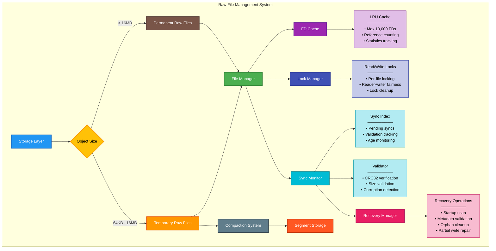

# RFC-004: File Management and Recovery

**RFC Number:** 004  
**Status:** Active  
**Authors:** Ovais Tariq  
**Created:** 2025-06-11  
**Last Updated:** 2025-09-11

## Abstract

This RFC describes OCache's raw file management system that handles direct file storage for objects that either bypass segment storage due to their size (> 16MB) or are temporarily stored as raw files before compaction into segments (64KB - 16MB). The system manages individual file operations, file descriptor caching, sync monitoring, and recovery mechanisms. It provides reliable storage for objects requiring direct file access while optimizing resource usage through intelligent FD caching and ensuring data durability through sync monitoring and validation. Recovery procedures handle various failure scenarios including partial writes, corrupted files, and orphaned data.

## Motivation

OCache uses raw file storage in two scenarios:

1. **Large Objects (> 16MB)**: Permanently stored as individual files, never compacted into segments
2. **Medium Objects (64KB - 16MB)**: Initially stored as raw files, later eligible for segment compaction

Direct file storage presents several challenges:

1. **File Descriptor Limits**: System FD limits require careful management
2. **Data Durability**: Ensuring writes are persisted to stable storage
3. **Crash Recovery**: Handling partial writes and corrupted files
4. **Resource Optimization**: Minimizing syscall overhead and memory usage
5. **Consistency**: Coordinating file operations with metadata updates
6. **Lifecycle Management**: Tracking which files are temporary vs permanent

The raw file management system addresses these through:

- Intelligent FD caching with LRU eviction
- Sync monitoring with validation
- Comprehensive recovery mechanisms
- Lock-based coordination for concurrent access
- Atomic operations with rollback capability
- Integration with compaction system for medium object migration

## Design Overview

### System Architecture



### Core Components

#### File Manager

The central component that orchestrates all raw file operations. It maintains:

- Base directory path for file storage
- File descriptor cache for efficient file access
- Lock manager for coordinating concurrent read/write operations
- Sync monitor for tracking and validating file durability
- RocksDB connection for metadata persistence

#### FD Cache

An LRU cache managing open file descriptors to minimize syscall overhead:

- Maximum capacity of 10,000 cached file descriptors
- Reference counting to prevent premature eviction
- Statistics tracking for hit/miss ratios and performance monitoring
- Thread-safe operations with read-write locking

#### File Lock Manager

Provides fine-grained locking at the file level:

- Maps file paths to read-write locks
- Supports multiple concurrent readers
- Ensures exclusive write access
- Automatic cleanup of unused locks to prevent memory leaks

#### Sync Monitor

Tracks file sync operations to ensure durability:

- Maintains index of pending file sync operations in RocksDB
- Detection and recovery of partial writes
- Integration with file validator for integrity checking

## Detailed Design

### File Creation and Writing

#### Atomic File Creation

The file creation process ensures atomicity and durability through a multi-step protocol:

1. **Filename Generation**: Creates unique filenames using UUIDs to prevent collisions.

2. **Exclusive Creation**: Files are created with exclusive flags (O_CREATE|O_EXCL) to prevent race conditions. If a file already exists, the operation fails atomically.

3. **Checksum Calculation**: CRC32 checksums are computed for all data before writing to enable later validation.

4. **Durability Guarantee**: fsync() is not called when the file is written. This means that the file is not guaranteed to be durable until the Kernel flushes the file buffers.

5. **Sync Tracking**: The file is registered with the sync monitor as pending. This ensures recovery can detect incomplete writes.

```
PROCEDURE CreateFile(key, value):
    filename = GenerateUniqueFilename(key)
    filepath = JoinPath(base_directory, filename)

    file = OpenExclusive(filepath)
    IF file_exists:
        RETURN AlreadyExists

    checksum = CalculateCRC32(value)

    AddToPendingSyncs(filepath, length(value), checksum)

    WriteData(file, value)
    IF write_error:
        CloseAndDelete(file)
        RETURN write_error

    CloseFile(file)
    RETURN filepath
```

#### Streaming Writes for Large Objects

For large objects (> 16MB), the system provides streaming writers that handle data incrementally without loading entire objects into memory:

**Streaming Writer Creation**:

1. Generates unique filename
2. Ensures parent directory exists (creates if necessary)
3. Opens file with exclusive access
4. Initializes incremental CRC32 calculation
5. Returns writer handle for streaming operations

**Write Operations**:

- Accepts data chunks of arbitrary size
- Updates running checksum incrementally
- Tracks total bytes written
- Supports standard I/O writer interface

**Finalization Protocol**:

1. Computes final CRC32 checksum
2. Registers file in sync monitor as pending
3. Handles cleanup on failure

```
STRUCTURE StreamingWriter:
    file_handle
    file_path
    checksum_calculator
    bytes_written
    file_manager_ref

PROCEDURE CreateStreamingWriter(key):
    filename = GenerateUniqueFilename(key)
    filepath = JoinPath(base_directory, filename)

    EnsureDirectoryExists(DirectoryOf(filepath))

    file = OpenExclusive(filepath)

    RETURN StreamingWriter {
        file: file,
        path: filepath,
        checksum: NewCRC32Calculator(),
        written: 0
    }

PROCEDURE StreamingWriter.Write(data):
    bytes_written = WriteToFile(file, data)
    UpdateChecksum(checksum, data[0:bytes_written])
    written += bytes_written
    RETURN bytes_written

PROCEDURE StreamingWriter.Close():
    final_checksum = GetChecksum(checksum)

    AddToPendingSyncs(path, written, final_checksum)

    CloseFile(file)
    RETURN success
```

### File Descriptor Caching

#### LRU Cache Implementation

The FD cache reduces syscall overhead by maintaining a pool of open file descriptors with LRU eviction policy:

**Cache Structure**:

- LRU eviction with 10,000 entry capacity
- Reference counting prevents eviction of in-use files
- Thread-safe operations with read-write locking
- Statistics tracking for monitoring and tuning

**Cache Entry Metadata**:

- Open file handle
- File path for identification
- Last access time for LRU ordering
- Reference count for safe eviction

**Get Operation**:

1. Check cache under read lock for fast path
2. On hit: increment reference count, return handle
3. On miss: open file, create entry, add to cache
4. Handle eviction if cache is full
5. Only evict entries with zero reference count

**Put Operation**:

- Decrements reference count when file use completes
- Enables eviction when count reaches zero
- Does not immediately close file (kept in cache)

```
STRUCTURE FileEntry:
    file_handle
    file_path
    reference_count

PROCEDURE FdCache.Get(path):
    // Fast path: check cache
    WITH read_lock:
        IF entry = cache.Lookup(path):
            IncrementRefCount(entry)
            RETURN entry.file_handle

    // Slow path: open file
    file = OpenFile(path)
    IF error:
        RETURN error

    entry = CreateFileEntry(file, path)

    WITH write_lock:
        evicted = cache.Add(path, entry)

        IF evicted AND evicted.reference_count == 0:
            CloseFile(evicted.file_handle)

    RETURN file

PROCEDURE FdCache.Put(path):
    WITH read_lock:
        IF entry = cache.Lookup(path):
            DecrementRefCount(entry)
```

### File Locking

#### Read-Write Lock Manager

The lock manager provides fine-grained concurrency control at the file level, preventing data races and ensuring consistency:

**Lock Properties**:

- Multiple concurrent readers allowed
- Single exclusive writer
- Fair scheduling between readers and writers
- Automatic cleanup of unused locks
- Lock-free fast path for checking lock status

**Lock Acquisition Protocol**:

1. **Read Lock**:

   - Check if lock exists, create if needed
   - Increment waiting reader count
   - Acquire shared lock
   - Track active reader count
   - Return unlock closure for cleanup

2. **Write Lock**:
   - Check if lock exists, create if needed
   - Increment waiting writer count
   - Acquire exclusive lock
   - Mark as writer-held
   - Return unlock closure for cleanup

**Lock Release and Cleanup**:

- Decrements appropriate counter on release
- Last user triggers cleanup check
- Removes lock from map if no waiters
- Prevents memory leak from abandoned locks

### Sync Monitoring and Validation

#### Sync Index Management

The sync monitor ensures data durability by tracking pending sync operations and validating completed writes:

**Sync Monitor Components**:

- RocksDB-based index for persistent tracking
- File validator for integrity checking
- Periodic validation at configurable intervals

**Pending Sync Tracking**:

When a file write begins, it's registered as pending. This allows detection of crashes during sync operations. Each pending entry contains:

- File path identifier
- Timestamp for age tracking
- Expected size and checksum

**Validation Process**:

The monitor periodically scans pending syncs and validates their status:

1. **Success**: File exists with correct size/checksum → Remove from pending
2. **Corrupted**: File exists but validation fails → Mark for recovery
3. **Missing**: File doesn't exist → Cleanup orphaned metadata
4. **Pending**: Still syncing → Check age

#### File Validation

The file validator ensures data integrity through comprehensive checks:

**Validation Steps**:

1. **Metadata Retrieval**: Fetch expected size and checksum from RocksDB
2. **Existence Check**: Verify file exists on disk
3. **Size Validation**: Compare actual vs expected file size
4. **Checksum Verification**: Calculate CRC32 and compare with stored value

**Validation Results**:

- **Success**: All checks pass
- **Missing**: File doesn't exist on disk
- **Corrupted**: Size or checksum mismatch
- **Error**: I/O or system error during validation

**Checksum Calculation**:

CRC32 checksums are computed incrementally using 64KB buffers to minimize memory usage while validating large files. This allows validation of files larger than available memory.

### Recovery System

#### Startup Recovery

The recovery manager performs comprehensive validation and repair during system startup:

**Recovery Manager Components**:

- File manager reference for raw file operations
- RocksDB connection for metadata access
- Statistics tracking for recovery metrics

**Four-Phase Recovery Process**:

1. **Metadata Consistency Validation**:

   - Verifies RocksDB metadata integrity
   - Checks for corrupted or incomplete entries

2. **File Scanning and Validation**:

   - Traverses the pending syncs index
   - Matches files with metadata entries
   - Validates checksums and sizes
   - Deletes the corrupted files and metadata entries

3. **Orphan Cleanup**:
   - Identifies files without metadata
   - Respects grace period before deletion
   - Removes stale sync entries

**File Validation During Recovery**:

For each file discovered during scan:

- **Valid**: Increment success counter, continue
- **Corrupted**: Deletes the corrupted file and metadata entry
- **Size Mismatch**: Fix file size based on metadata
- **Orphaned**: Deletes the orphaned file and metadata entry

## Trade-offs and Design Decisions

### Decision: Sync Monitoring

**Choice**: Track pending syncs and validate asynchronously

**Rationale**:

- Ensures durability without blocking writes
- Detects partial writes and corruption
- Enables recovery from crashes

**Alternative**: fsync() after every write

- Pros: Immediate feedback
- Cons: High latency impact, not scalable

## Future Work

1. **Direct I/O**: Bypass page cache for large files
2. **io_uring Integration**: Async I/O on Linux 5.1+
3. **Compression**: Transparent compression for files

## References

- [The Design and Implementation of a Log-Structured File System](https://people.eecs.berkeley.edu/~brewer/cs262/LFS.pdf)
- [io_uring: Efficient Linux Async I/O](https://kernel.dk/io_uring.pdf)
- [Optimizing File Systems for Fast Storage](https://www.usenix.org/sites/default/files/conference/protected-files/fast20_slides_conway.pdf)
