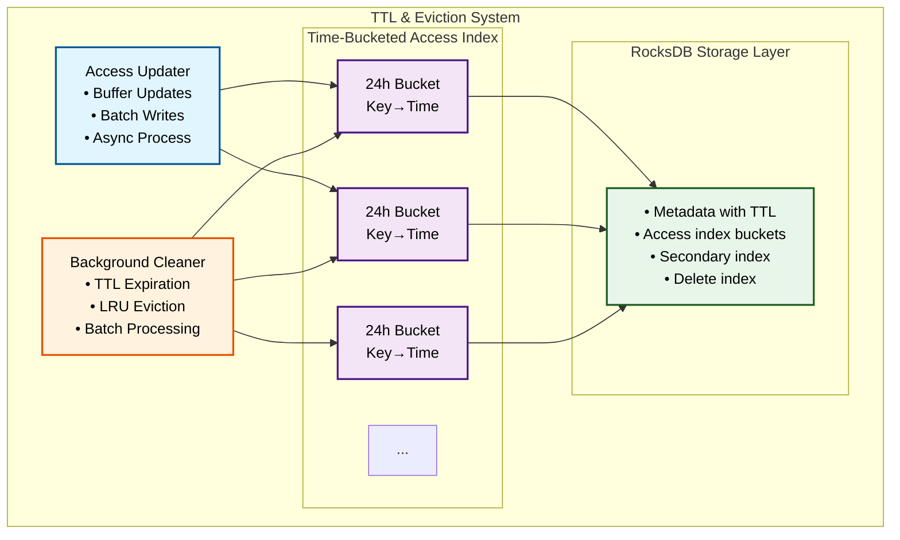

# RFC-005: TTL and Eviction System

**RFC Number:** 005  
**Status:** Active  
**Authors:** Ovais Tariq  
**Created:** 2024-08-20  
**Last Updated:** 2025-09-11

## Abstract

This RFC describes OCache's TTL (Time-To-Live) expiration and LRU (Least Recently Used) eviction system that manages cache capacity and ensures timely removal of expired data. The system implements a multi-tiered approach with time-bucketed access tracking, efficient batch processing, and adaptive eviction strategies. The design balances memory efficiency, query performance, and eviction accuracy while minimizing impact on foreground operations.

## Motivation

Cache management faces several fundamental challenges:

1. **TTL Expiration**: Timely removal of expired entries without full scans
2. **Capacity Management**: Enforcing disk usage limits through intelligent eviction
3. **Access Tracking**: Maintaining access patterns with minimal overhead
4. **Batch Efficiency**: Processing millions of entries without blocking operations
5. **Memory Efficiency**: Tracking access times for millions of objects

The TTL and eviction system addresses these through:

- Time-bucketed access index for efficient range queries
- Background cleaner with adaptive scheduling
- Batched operations with incremental progress
- Merge operators for lock-free access updates
- Hybrid TTL/LRU eviction policies

## Design Overview

### System Architecture

### Core Components

#### Background Cleaner

The cleaner component manages both TTL expiration and LRU eviction through a single background goroutine. It operates on a configurable interval (default 1 minute) and maintains atomic statistics for monitoring.

**Key Responsibilities:**

- Periodic scanning for expired keys based on TTL metadata
- Enforcement of disk usage limits through LRU eviction
- Batch processing to minimize RocksDB write amplification
- Atomic size tracking for real-time capacity monitoring

**Operational Characteristics:**

- **Scan Interval**: Configurable, typically 1 minute for TTL checks
- **Bucket Cleanup**: Every 24 hours for old access buckets (>30 days)
- **Batch Size**: 1000 keys per write batch to balance memory and throughput
- **Target Utilization**: 90% of max disk usage after eviction

#### Time-Bucketed Access Index

The access tracking system uses time-based bucketing to efficiently manage millions of access records without excessive memory overhead.

**Design Principles:**

- **Bucket Granularity**: 24-hour buckets for access time grouping
- **Key Format**: `!access_bucket:bucket:<timestamp>/<key>` for range queries
- **Secondary Index**: `!access_bucket:index/<key>` points to current bucket entry

**Benefits:**

- O(1) access updates using secondary index
- Efficient LRU iteration from oldest to newest buckets
- Automatic cleanup of old buckets without full scans
- Minimal memory overhead for tracking

## Detailed Design

### Access Tracking

#### Time-Bucketed Index Structure

The access tracking system maintains a time-ordered index of object accesses using a dual-index approach:

**Primary Bucketed Index:**

- **Key Format**: `!access_bucket:bucket:<unix_timestamp>/<user_key>`
- **Value Format**: 8-byte Unix timestamp of last access
- **Bucket Size**: 24-hour periods aligned to UTC midnight
- **Purpose**: Enables efficient LRU traversal from oldest to newest

**Secondary Lookup Index:**

- **Key Format**: `!access_bucket:index/<user_key>`
- **Value Format**: Current bucket key for the object
- **Purpose**: O(1) lookup and update of access times

**Update Process:**

1. Calculate the current 24-hour bucket based on access time
2. Read the secondary index to find the previous bucket entry
3. Delete the old bucket entry if it exists
4. Insert new bucket entry with current timestamp
5. Update secondary index to point to new bucket

**LRU Traversal Process:**

1. Start iteration at the oldest bucket prefix (`!access_bucket:bucket:`)
2. Parse bucket keys to extract original key and access time
3. Process keys in timestamp order for eviction
4. Stop when sufficient space is reclaimed

#### Asynchronous Access Updates

Access tracking operates asynchronously to minimize impact on the critical path of cache operations:

**Buffering Strategy:**

- **Channel Buffer**: Configurable size (default 10,000) for incoming updates
- **Coalescing Map**: In-memory map to merge multiple updates for the same key
- **Drop Policy**: Best-effort tracking; updates dropped when buffer full
- **Batch Interval**: Flush accumulated updates every 5 seconds

**Update Coalescing:**
Multiple accesses to the same key within the batch interval are coalesced:

1. First access creates entry in pending map
2. Subsequent accesses update timestamp if newer
3. Only the latest access time is written to RocksDB
4. Reduces write amplification by 10-100x for hot keys

**Batch Writing Process:**

1. Accumulate updates in memory for batch interval
2. Apply minimum delay threshold to filter noise
3. Construct RocksDB write batch with all updates
4. Write atomically to ensure consistency
5. Clear pending map and continue

### TTL Expiration

#### Efficient TTL Scanning

The TTL expiration process performs incremental scanning of metadata entries to identify and remove expired objects:

**Scanning Strategy:**

- **Iterator-based**: Uses RocksDB iterators for memory-efficient scanning
- **Prefix Filtering**: Only scans metadata keys (prefix `!meta/`)
- **Batch Processing**: Groups deletions into 1000-key batches
- **Interruptible**: Checks for shutdown signals between operations
- **Yield Points**: Introduces 10ms sleep after each batch to prevent blocking

**Expiration Process:**

1. **Metadata Scan**: Iterate through all metadata entries
2. **TTL Check**: Compare expiry timestamp with current time
3. **Batch Deletion**: Accumulate expired keys in write batch
4. **Access Cleanup**: Remove corresponding access index entries
   - Delete primary bucket entry using secondary index lookup
   - Delete secondary index entry
5. **Storage Cleanup**: Queue associated storage for deletion
   - Raw files: Add to deletion queue for delayed removal
   - Segments: Update delete index for garbage collection
6. **Atomic Commit**: Write batch to RocksDB atomically

### LRU Eviction

#### Disk Usage Monitoring

The system maintains an accurate view of total disk usage through continuous tracking:

**Size Calculation:**
The cleaner performs an initial full scan on startup to establish baseline usage:

1. **Metadata Iteration**: Scan all metadata entries
2. **Size Aggregation**: Sum `ValueLength` fields from metadata
3. **Atomic Storage**: Store total in atomic variable for lock-free reads
4. **Metric Updates**: Export to Prometheus metrics

**Incremental Updates:**
After initialization, size is maintained incrementally:

- **On Write**: Add object size to total
- **On Delete**: Subtract object size from total
- **On Update**: Adjust by size delta
- **Atomic Operations**: All updates use atomic add/subtract

**Eviction Triggers:**

- **Threshold**: Triggers when usage exceeds configured maximum
- **Target Level**: Evicts to 90% of maximum to provide headroom
- **Check Frequency**: Evaluated every cleaner interval (1 minute)
- **Bypass**: Disabled when `maxDiskUsage <= 0`

#### LRU Eviction Algorithm

The LRU eviction system uses the time-bucketed access index to efficiently identify and remove least recently used objects:

**Eviction Strategy:**

**1. Bucket Traversal:**
The system iterates through buckets from oldest to newest:

- Start with the oldest bucket prefix (`!access_bucket:bucket:`)
- Process buckets in chronological order
- Stop when target bytes are reclaimed
- Maximum lookback of 30 days

**2. Key Processing:**
For each key in the access index:

- Parse bucket key to extract original key and access time
- Retrieve metadata to determine object size and type
- Check for orphaned entries (access without metadata)
- Skip objects with unexpired TTL (will be cleaned by TTL process)

**3. Eviction Decision:**
Objects are evicted based on:

- **Age**: Oldest accessed objects first
- **TTL Status**: Only evict objects without active TTL or expired TTL
- **Size**: Track cumulative size to meet target
- **Validation**: Verify metadata exists and is valid

**4. Cleanup Operations:**
For each evicted object:

- Delete metadata entry
- Delete access index entries (primary and secondary)
- Queue storage cleanup:
  - Raw files: Direct deletion via file manager
  - Segments: Update delete index for garbage collection
- Update size tracking atomically

**5. Batch Processing:**

- Accumulate deletions in write batches
- Flush every 1000 operations
- Yield CPU periodically to prevent blocking
- Check for shutdown signals between batches

### Access Time Bucket Cleanup

#### Old Bucket Removal

The system automatically removes old access tracking buckets to prevent unbounded growth:

**Cleanup Policy:**

- **Retention Period**: 30 days of access history
- **Cleanup Frequency**: Every 24 hours
- **Trigger**: Independent of disk usage limits
- **Purpose**: Prevent metadata bloat in RocksDB

**Cleanup Process:**

1. **Cutoff Calculation**: Determine timestamp 30 days ago
2. **Bucket Discovery**: Iterate through access bucket prefixes
3. **Age Check**: Parse bucket timestamp from key
4. **Bulk Deletion**: For buckets older than cutoff:
   - Create nested iterator for bucket contents
   - Batch delete all entries in the bucket
   - Include secondary index cleanup
5. **Atomic Commit**: Write deletions in 1000-key batches

**Cleanup Cycle Operations:**

1. **TTL Expiration**: Always runs first
2. **Disk Usage Check**: Evaluate need for LRU eviction
3. **LRU Eviction**: Only if disk usage exceeds limit
4. **Bucket Cleanup**: Every 24 hours for old buckets

## Trade-offs and Design Decisions

### Decision: Time-Bucketed Access Index

**Choice**: 24-hour buckets for access tracking

**Rationale**:

- Efficient range scans for LRU
- Bounded memory usage
- Simple bucket cleanup

**Alternative**: Per-key access timestamps

- Pros: More precise LRU
- Cons: Unbounded growth, expensive updates

### Decision: Best-Effort Access Tracking

**Choice**: Drop updates when buffer full

**Rationale**:

- Prevents blocking on reads
- Access patterns are approximate anyway
- System remains responsive

**Alternative**: Blocking updates

- Pros: Perfect accuracy
- Cons: Read latency impact

## Future Work

1. **Distributed Coordination**: Coordinate eviction across cluster nodes
2. **Custom Eviction Policies**: Pluggable eviction strategies

## References

- [Efficient LRU Implementation](https://github.com/hashicorp/golang-lru)
- [Time-Series Databases: Design Patterns](https://vldb.org/pvldb/vol8/p1816-teller.pdf)
- [Redis Eviction Policies](https://redis.io/docs/latest/develop/reference/eviction/)
