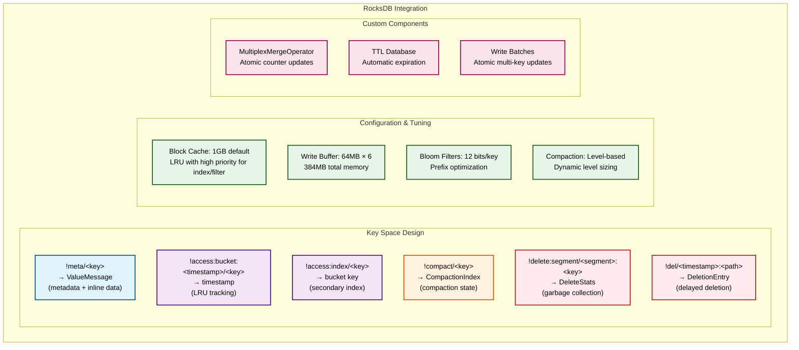

# RFC-006: RocksDB Integration

**RFC Number:** 006  
**Status:** Active  
**Authors:** Ovais Tariq  
**Created:** 2025-06-05  
**Last Updated:** 2025-09-12

## Abstract

This RFC describes OCache's integration with RocksDB as the metadata storage engine and small object store. RocksDB provides the foundation for storing object metadata, inline small objects, access indices, and various system indices. The integration includes custom merge operators for atomic operations, optimized configuration for mixed workloads, and careful key encoding schemes to enable efficient range scans and prefix iterations.

## Motivation

RocksDB was chosen as the metadata engine for several reasons:

1. **Proven Reliability**: Battle-tested in production at scale
2. **Write Optimization**: LSM-tree architecture ideal for write-heavy workloads
3. **Atomic Operations**: Write batches and merge operators for consistency
4. **Compression**: Built-in compression reduces storage overhead
5. **Tunable Performance**: Extensive configuration options for optimization
6. **TTL Support**: Native TTL with automatic expiration

The integration addresses:

- Storing billions of metadata entries efficiently
- Atomic multi-key updates during compaction
- Lock-free access tracking via merge operators
- Efficient range scans for cleanup operations
- Consistent crash recovery

## Design Overview

### Architecture

### Key Components

#### MetaDB Abstraction

The MetaDB provides a thin abstraction layer over RocksDB, managing the global database instance and lifecycle:

**Responsibilities:**

- **Singleton Management**: Ensures single global RocksDB instance
- **Configuration Application**: Applies optimized settings during initialization
- **Handle Access**: Provides controlled access to underlying RocksDB handle
- **Lifecycle Management**: Coordinates initialization and shutdown

## Detailed Design

### Key Encoding Schemes

#### Metadata Keys

Metadata keys store the primary object information and optional inline data:

**Format:** `!meta/<user_key>`

**Key Construction:**

1. Start with fixed prefix `!meta/` for efficient range scans
2. Append user-provided key directly
3. No additional encoding for simplicity

**Key Extraction:**

1. Verify prefix presence
2. Remove prefix to obtain original user key
3. Return empty string if prefix doesn't match

**Design Rationale:**

- Fixed prefix enables efficient metadata-only iterations
- Direct user key preserves sort order
- Simple format minimizes encoding overhead

### Database Configuration

#### RocksDB Configuration

The RocksDB configuration is organized into logical groups for different aspects of performance:

**Memory Configuration:**

- **Block Cache Size**: 1GB default, stores decompressed data blocks
- **Write Buffer Size**: 64MB per buffer, in-memory write accumulation
- **Max Write Buffers**: 6 buffers, allowing 384MB total memory
- **DB Write Buffer Size**: Global limit across all column families

**Compaction Configuration:**

- **Level0 File Triggers**: 3 files trigger compaction, 10 slowdown, 20 stop
- **Level Sizes**: L1=192MB, 10x multiplier per level
- **Target File Size**: 64MB base, 2x multiplier for higher levels
- **Dynamic Level Sizing**: Automatically adjusts level boundaries

**Performance Configuration:**

- **Bloom Filter Bits**: 12 bits per key for false positive reduction
- **Block Size**: 16KB optimized for small values
- **Max Background Jobs**: 8 concurrent compaction/flush jobs

**Durability Configuration:**

- **WAL Recovery Mode**: Point-in-time recovery for consistency
- **Bytes Per Sync**: 512KB for WAL and SST file syncing

### Merge Operators

#### Multiplex Merge Operator

The multiplex merge operator routes different merge operations based on key prefixes, enabling atomic updates without explicit locking:

**Architecture:**

The operator maintains a registry of prefix-specific merge functions:

- **Access Time Merges**: Keep latest timestamp
- **Delete Statistics Merges**: Sum deletion counts
- **Counter Merges**: Increment/decrement atomically

**Full Merge Operation:**

1. **Prefix Detection**: Identify key type from prefix
2. **Function Selection**: Choose appropriate merge function
3. **Operand Application**: Apply all pending operands sequentially
4. **Result Computation**: Produce final merged value
5. **Fallback**: Last-write-wins for unknown prefixes

**Partial Merge Operation:**

Combines two operands during compaction:

1. Route based on key prefix
2. Apply type-specific merge logic
3. Return combined operand
4. Reduce write amplification

**Access Time Merge Logic:**

- Compare timestamps as 19-digit integers
- Keep the more recent timestamp
- Handle empty existing values
- Preserve binary format

**Delete Statistics Merge Logic:**

- Deserialize protobuf statistics
- Sum deletion counts across operands
- Sum total bytes deleted
- Serialize combined statistics

### TTL Database Integration

The system integrates RocksDB's native TTL support for automatic expiration:

**Database Initialization:**

**Configuration Steps:**

1. Create default RocksDB configuration
2. Apply optimized settings for workload
3. Set up merge operator for atomic operations
4. Determine database path location

**TTL Mode Selection:**

- **With TTL (>0)**: Opens database with TTL support
  - Automatic expiration during compaction
  - No manual cleanup required
  - Configurable expiration time in seconds
- **Without TTL (0)**: Opens standard database
  - Manual expiration handling required
  - Used for persistent metadata
  - No automatic cleanup

## Configuration Tuning

### Workload-Specific Optimization

Different workload patterns benefit from tailored RocksDB configurations:

**Write-Heavy Workload:**

- **Write Buffer**: 256MB per buffer, 6 buffers total
- **Background Jobs**: 16 concurrent for compaction
- **Level Base**: 1GB for L1 to reduce write amplification
- **Compaction Style**: Level-based with larger targets

**Read-Heavy Workload:**

- **Block Cache**: 16GB for maximum hit rate
- **Bloom Filters**: 15 bits per key for accuracy
- **Open Files**: Unlimited to avoid reopening
- **Prefetch**: Enable for sequential reads

**Mixed Workload (Default):**

- **Balanced Settings**: Default configuration
- **Moderate Cache**: 1GB block cache
- **Standard Buffers**: 64MB write buffers
- **Adaptive**: Responds to actual usage

**Memory-Constrained:**

- **Minimal Cache**: 1GB block cache only
- **Small Buffers**: 64MB with 2 buffers max
- **Reduced Parallelism**: Fewer background jobs
- **Aggressive Compression**: ZSTD for all levels

## Trade-offs and Design Decisions

### Decision: Single Database vs Column Families

**Choice**: Single database with key prefixes

**Rationale**:

- Simpler implementation and management
- Sufficient performance with proper prefixing
- Easier backup and recovery

**Alternative**: Column families for different data types

- Pros: Independent configuration per type
- Cons: More complex, higher memory overhead

## Future Work

1. **Encryption**: At-rest encryption support
2. **Compression**: Enable compression for all levels

## References

- [RocksDB Documentation](https://github.com/facebook/rocksdb/wiki)
- [RocksDB Tuning Guide](https://github.com/facebook/rocksdb/wiki/RocksDB-Tuning-Guide)
