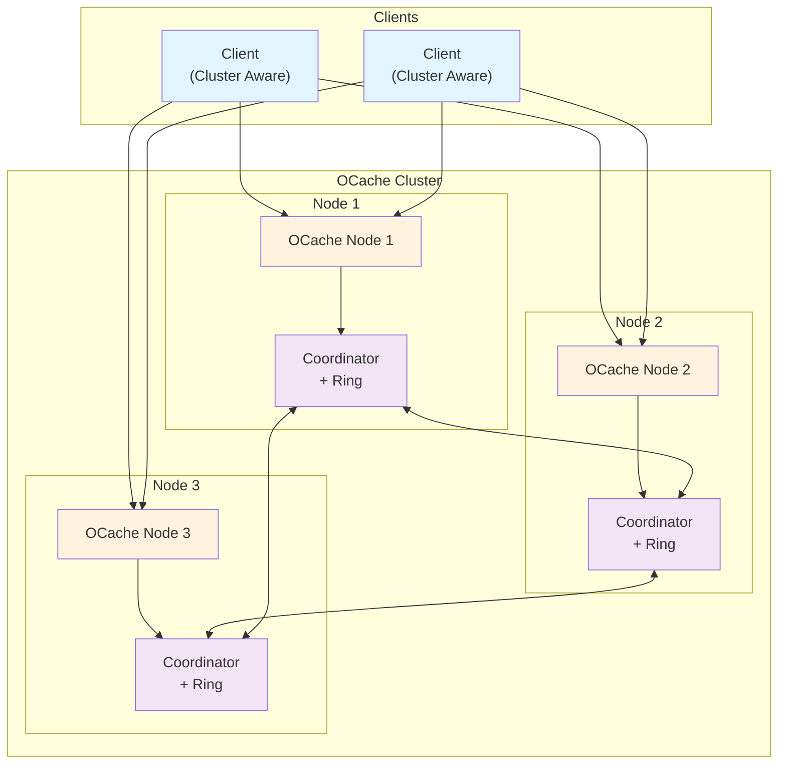
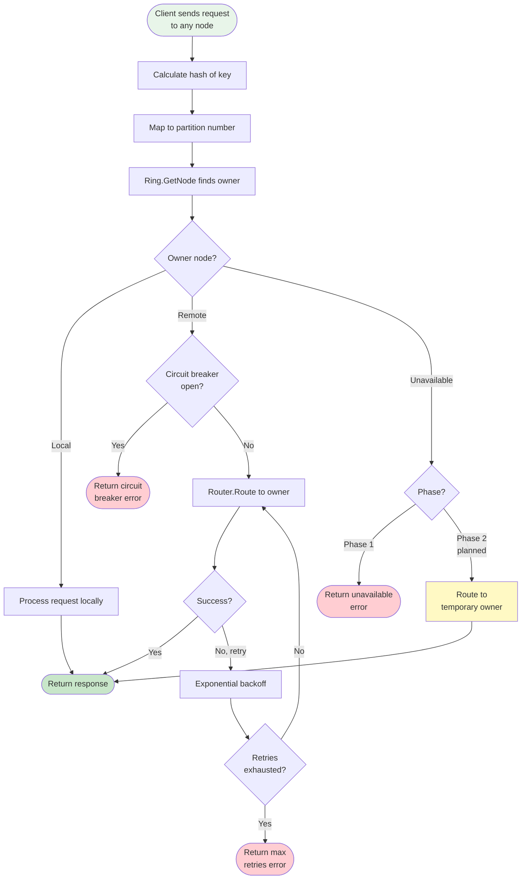
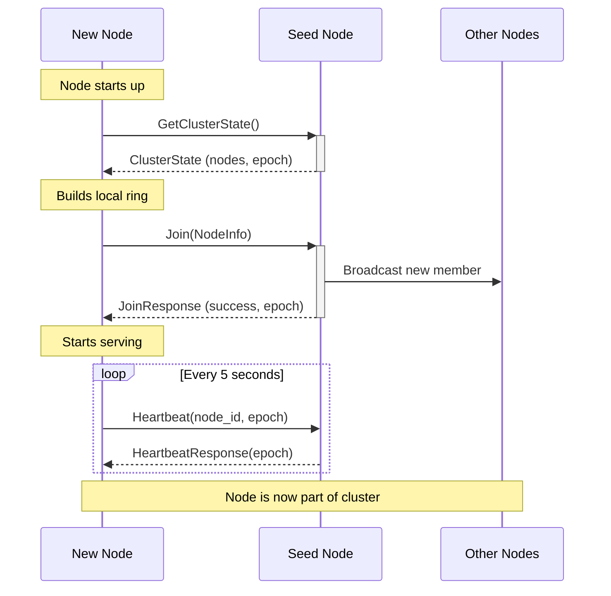

# RFC-007: Distributed Sharding and High Availability

**RFC Number**: 007
**Status**: Implemented (Phase 1)  
**Author(s)**: Ovais Tariq
**Created**: 2025-08-20
**Last Updated**: 2025-09-16

## 1. Abstract

This RFC describes the design and implementation of a distributed sharding system for OCache that enables horizontal scaling across multiple nodes. The system uses consistent hashing for data distribution, provides high availability through temporary ownership transfer (without full replication), and implements efficient failure detection and recovery mechanisms.

## 2. Motivation

### 2.1 Problem Statement

OCache currently operates as a single-node cache service. This presents several limitations:

- **Scalability**: Limited by single machine resources (CPU, memory, disk)
- **Availability**: Single point of failure
- **Performance**: Cannot distribute load across multiple machines
- **Capacity**: Cannot exceed single machine storage limits

### 2.2 Goals

- Enable horizontal scaling across multiple nodes
- Provide high availability without full data replication
- Minimize data movement during topology changes
- Maintain consistent performance during node failures
- Support graceful node addition and removal
- Enable cluster-aware client with smart routing

### 2.3 Non-Goals

- Full data replication (traditional N-way replication)
- Strong consistency guarantees (eventual consistency is acceptable)
- Cross-datacenter replication
- Automatic data rebalancing on node addition

## 3. Design Overview

### 3.1 Core Principles

1. **No Data Replication**: Achieve HA through temporary ownership transfer during failures
2. **Minimal Data Movement**: Only transfer changed keys (deltas) during recovery
3. **Consistent Routing**: Use consistent hashing with virtual nodes for even distribution
4. **Graceful Degradation**: Maintain availability during partial failures
5. **Simple Operations**: Easy to understand and operate

### 3.2 High-Level Architecture



### 3.3 Key Components

1. **Consistent Hash Ring**: Determines data ownership using buraksezer/consistent library
2. **Coordinator**: Manages membership and routing, implements ClusterService gRPC interface
3. **Router**: Handles request forwarding with retries, circuit breaking, and connection pooling
4. **Failure Detector**: Monitors node health via heartbeats with configurable thresholds
5. **Node Discovery**: Static or DNS-based discovery with address validation
6. **Cluster Client**: Client-side routing with local ring replica and topology caching
7. **Error Handling**: Structured error types with retryable/non-retryable classification

## 4. Detailed Design

### 4.1 Consistent Hashing

- Uses xxhash64 for consistent hashing (via custom Hasher implementation)
- Virtual nodes (vnodes) for better distribution (DefaultReplicationFactor: 20)
- Partition count: 16384 (DefaultPartitionCount, configurable)
- Load factor: 1.25 (DefaultLoad) for bounded loads
- Library: buraksezer/consistent for ring management

### 4.2 Request Routing



#### Router Configuration

- **Connection Timeout**: 5 seconds
- **Max Message Size**: 128MB (send and receive)
- **Max Retries**: 3 attempts
- **Initial Retry Backoff**: 100ms
- **Max Retry Backoff**: 5 seconds
- **Keepalive Time**: 30 seconds
- **Keepalive Timeout**: 10 seconds
- **Circuit Breaker Threshold**: 5 consecutive failures
- **Circuit Breaker Timeout**: 30 seconds

### 4.3 Cluster Membership

#### 4.3.1 Join Protocol



#### 4.3.2 Failure Detection

- **Heartbeat Interval**: 5 seconds (DefaultHeartbeatInterval, configurable)
- **Heartbeat Request Timeout**: 2 seconds
- **Failure Detection Interval**: 10 seconds (periodic health check)
- **Failure Threshold**: 3 missed heartbeats (DefaultFailureThreshold)
- **Detection Time**: ~15 seconds
- **State Transitions**: Active → Down (no intermediate states in Phase 1)

#### 4.3.3 Seed Discovery

- **Static Discovery**: Direct list of node addresses
- **DNS Discovery**: DNS resolution for dynamic node discovery (e.g., Kubernetes headless service)
- **DNS Refresh Interval**: 30 seconds (DefaultDNSRefreshInterval, configurable)
- **Address Validation**: Validates addresses based on allowLocalhost flag (for testing)

#### 4.3.4 Graceful Node Departure

When a node receives SIGINT/SIGTERM, it announces its departure before shutting down:

- **Leave Broadcast**: Sends Leave RPC to up to 10 active nodes (MaxBroadcastNodes)
- **Broadcast Timeout**: 5 seconds (LeaveAnnouncementTimeout)
- **Node Removal**: Receiving nodes immediately remove departing node from ring
- **Cleanup**: Deletes heartbeat tracking and closes connections
- **Fallback**: Nodes that miss broadcast detect departure via passive failure detection (~3s)

**Benefits:**

- Reduces detection time from ~15s (passive) to < 1s (active announcement)
- Distinguishes graceful shutdown from crashes
- Prevents unnecessary request routing to departed nodes
- Clean cluster state without stale entries

### 4.4 Cluster State Synchronization

The cluster maintains eventual consistency through six complementary synchronization mechanisms:

#### 4.4.1 Synchronization Mechanisms

| Mechanism             | Type    | Frequency        | Purpose                                    | Nodes Notified         | Discovery Mode |
| --------------------- | ------- | ---------------- | ------------------------------------------ | ---------------------- | -------------- |
| **Initial Sync**      | Pull    | Once (startup)   | Bootstrap new node with full cluster state | 1 (seed node)          | Both           |
| **Join Broadcast**    | Push    | On join event    | Announce new member via gossip cascade     | Up to 10 (with gossip) | Both           |
| **Heartbeat**         | Push    | Every 1 second   | Liveness detection + epoch verification    | All active nodes       | Both           |
| **Failure Detection** | Passive | Every 10 seconds | Mark failed nodes as DOWN                  | 0 (local only)         | Both           |
| **Leave Broadcast**   | Push    | On graceful stop | Announce departure to cluster              | Up to 10               | Both           |
| **Discovery Loop**    | Pull    | Every 30 seconds | Re-discover dynamic nodes via DNS          | N/A (DNS query)        | DNS only       |

#### 4.4.2 Initial Sync (Bootstrap) - Pull Model

When a new node joins:

1. **Pull Cluster State**: `GetClusterState()` from seed node

   - Returns: Full member list, addresses, epoch
   - New node builds local hash ring

2. **Announce Join**: `Join()` RPC to seed node

   - Seed adds new node to its ring
   - Seed broadcasts join to up to 10 other nodes

3. **Gossip Cascade**: Each notified node re-broadcasts (with deduplication)
   - Ensures all nodes learn about new member
   - Broadcast deduplication via 10-second cache

#### 4.4.3 Join Broadcast - Push Model with Gossip

**Process:**

```
New Node → Join(seed)
Seed → Broadcast Join to [Node2...Node11] (up to 10)
Node2 → Re-broadcast Join to [Node3...Node12] (if not duplicate)
...
Result: All nodes know about new member within ~1 second
```

**Deduplication:**

- Broadcasts cached for 10 seconds (DefaultBroadcastCacheTime)
- Prevents broadcast storms in large clusters
- Records successful broadcasts to avoid re-sending

#### 4.4.4 Heartbeat Loop - Continuous Sync

**Every node sends heartbeats every 1 second:**

```
Heartbeat {
    node_id: "sender-id"
    epoch: 42  // Current ring version
}
```

**Purpose:**

- ✅ Liveness detection (is node alive?)
- ✅ Epoch comparison (detect state divergence)
- ⚠️ Does NOT sync full state (passive check only)

**Receiver actions:**

- Updates `lastHeartbeat[node_id]` timestamp
- Compares epochs to detect version mismatch
- Logs warning if epochs differ (manual reconciliation required)

#### 4.4.5 Failure Detection - Reactive Sync

**Runs every 10 seconds on each node:**

```
timeout = failureThreshold × heartbeatInterval  // 3 × 1s = 3s

for each tracked node:
    if now - lastHeartbeat[node] > timeout:
        ring.UpdateNodeStatus(node, DOWN)
```

**Characteristics:**

- Each node detects failures independently
- No broadcast of failure state (eventual consistency)
- Node marked DOWN (not removed from topology)
- Detection time: ~15 seconds total
  - 3 failed heartbeat attempts (3s)
  - Periodic check runs every 10s (up to +10s)

#### 4.4.6 Graceful Departure - Push Model

**When node receives SIGINT/SIGTERM:**

```
Stop() → announceLeave()
  ↓
broadcastLeave() to up to 10 nodes
  ↓
Each node: Leave(departing_node_id)
  ↓
ring.RemoveNode(departing_node_id)
delete(heartbeat_tracking)
router.RemoveClient(departing_node_id)
```

**Fast vs Slow Path:**

- **Fast:** Nodes receiving Leave broadcast (< 1s)
- **Slow:** Nodes missing broadcast use failure detection (~3s)

#### 4.4.7 Discovery Loop - Dynamic Topology Updates

**DNS Discovery Mode Only** - runs every 30 seconds:

```
refreshNodes():
    newNodes = DNS.Resolve("ocache.namespace.svc.cluster.local")
    added, removed = DiffNodes(oldNodes, newNodes)

    for each added node:
        tryJoinNode(node)  // Async sync
```

**Purpose:**

- Handles Kubernetes pod scaling events
- Re-discovers nodes after IP changes
- Provides eventual consistency guarantee
- Resilient to DNS failures (24h cache)

**Example (Kubernetes):**

```
T=0s:   3 pods → DNS returns [10.1.2.3, 10.1.2.4, 10.1.2.5]
T=5s:   Scale to 4 pods
T=10s:  Pod4 bootstraps and joins cluster
T=30s:  Discovery loop runs on all nodes
        DNS returns [10.1.2.3, 10.1.2.4, 10.1.2.5, 10.1.2.6]
        Nodes confirm Pod4 is in cluster (redundant but safe)
```

#### 4.4.8 Complete Synchronization Flow

```
Node Startup:
    |
    v
[Pull] GetClusterState() from seed node
    |  - Returns full member list + epoch
    |  - Builds local hash ring
    v
[Push] Send Join() to seed
    |  - Seed adds node to ring
    |  - Seed broadcasts to cluster
    v
[Gossip] Join cascades through cluster
    |  - Up to 10 nodes per hop
    |  - Deduplication prevents storms
    v
Running State (All Modes):
    |
    +---> [Push] Heartbeats every 1s
    |       └─> Liveness + epoch check
    |
    +---> [Passive] Failure detection every 10s
    |       └─> Mark nodes DOWN if no heartbeat (3s timeout)
    |
    +---> [Event] New joins trigger broadcasts
    |       └─> Gossip cascade with deduplication
    |
    +---> [Event] Graceful leaves trigger broadcasts
    |       └─> Fast removal (< 1s) vs passive detection (~3s)
    |
    +---> [Pull] Discovery loop every 30s (DNS mode only)
            └─> Re-discover nodes, sync with new ones
```

#### 4.4.9 Synchronization Properties

**✅ Eventually Consistent:**

- No strong consistency (no Raft/Paxos consensus)
- Nodes may have brief inconsistencies (< 1 second)
- Converges through broadcasts + heartbeats + discovery

**✅ Broadcast Storm Prevention:**

- Limited to 10 nodes per broadcast (MaxBroadcastNodes)
- Deduplication via 10-second cache
- Gossip amplification ensures full coverage

**✅ Failure Recovery:**

- Fast path: Active broadcasts (< 1s)
- Medium path: Passive failure detection (~3s)
- Slow path: DNS discovery loop (30s, DNS mode only)

**⚠️ No Full State Reconciliation:**

- No periodic "sync everything" operation
- Relies on event-driven updates + epoch checking
- Manual intervention required for split-brain scenarios

### 4.6 Client Integration

#### ClusterClient Features

- Maintains local copy of ring topology (consistent.Consistent)
- Caches partition ownership mapping for fast lookups
- Routes requests directly to owner nodes
- Handles retries and failover with exponential backoff
- Refreshes topology periodically (30s default)
- Supports topology epoch tracking for consistency
- Round-robin fallback when routing information unavailable

#### Client Protocol

1. Connect to seed nodes to fetch initial topology
2. Build local hash ring from topology information
3. Cache partition ownership mapping
4. Route requests based on key hash
5. Refresh topology periodically or on routing errors

### 4.7 Data Consistency Model

#### 4.7.1 Phase 1: Best Effort

- No replication
- Data loss on node failure
- Eventually consistent after recovery
- No stale reads (data is either available or not)

#### 4.7.2 Phase 2: Hinted Handoff (Planned)

- Temporary ownership transfer during failures
- Hint storage for mutations during downtime
- Replay protocol on recovery
- Bounded inconsistency window

## 5. Performance Considerations

### 5.1 Latency Impact

- **Local requests**: No additional latency
- **Remote requests**: +1 network hop (~1-2ms in same DC)
- **Failed node requests**: +retry backoff (100ms initial)

### 5.2 Throughput

- **Horizontal scaling**: Near-linear with node count
- **Connection pooling**: Reduces connection overhead
- **Circuit breaker**: Prevents cascade failures

## 6. Operational Considerations

### 6.1 Failure Scenarios

| Scenario               | Impact                            | Recovery                                 |
| ---------------------- | --------------------------------- | ---------------------------------------- |
| Graceful shutdown      | Node announces departure          | Detected in < 1s (Leave broadcast)       |
| Crash/force kill       | Keys on failed node unavailable   | Detected in ~3s (failure detection)      |
| Single node failure    | Keys on failed node unavailable   | Automatic detection in ~15s (worst case) |
| Network partition      | Split brain possible              | Manual intervention required             |
| Cascading failures     | Circuit breakers prevent overload | Automatic recovery when nodes return     |
| DNS resolution failure | New nodes cannot join             | Cached nodes continue to be used (24h)   |
| Connection failure     | Retries with exponential backoff  | Circuit breaker opens after threshold    |

### 6.2 Error Types

#### Non-Retryable Errors

- `ErrNodeNotFound`: Target node doesn't exist in ring
- `ErrCircuitBreakerOpen`: Circuit breaker is open for a node
- `ErrLocalRouting`: Attempt to route to local node
- `ErrMaxRetriesExceeded`: All retry attempts exhausted

#### Retryable Errors

- `ErrConnectionFailed`: Failed to establish connection
- gRPC `Unavailable`, `DeadlineExceeded`, `Canceled`, `Aborted` codes

## 7. Security Considerations

### 7.1 Current State

- No authentication between nodes
- No encryption for inter-node communication
- Trust-based cluster membership

## 8. Alternatives Considered

### 8.1 Full Replication

- **Pros**: High availability, read scaling
- **Cons**: 2-3x storage overhead, complex consistency
- **Decision**: Rejected in favor of hinted handoff

### 8.2 Master-Slave Replication

- **Pros**: Simple consistency model
- **Cons**: Write bottleneck, failover complexity
- **Decision**: Rejected for poor write scaling

### 8.3 External Coordination (Zookeeper/etcd)

- **Pros**: Battle-tested coordination
- **Cons**: Additional dependency, operational complexity
- **Decision**: Rejected for simplicity

## 9. Implementation Status

### Phase 1 (Completed)

- ✅ Consistent hash ring with virtual nodes
- ✅ Coordinator service with membership management
- ✅ Node discovery (static and DNS)
- ✅ Failure detection with heartbeats
- ✅ Graceful node departure with Leave broadcasts
- ✅ Six-layer synchronization system (pull, push, gossip, heartbeat, passive, discovery)
- ✅ Router with connection pooling and circuit breakers
- ✅ Cluster-aware client with smart routing
- ✅ Protocol buffer definitions for cluster communication
- ✅ Error handling with retry logic
- ✅ Topology synchronization and epoch tracking
- ✅ Broadcast deduplication and storm prevention

### Phase 2 (Planned)

- ⏳ Hinted handoff for temporary ownership transfer
- ⏳ Hint storage and replay protocol
- ⏳ Automatic data rebalancing on node addition
- ⏳ Advanced load balancing strategies
- ⏳ Multi-datacenter support

## 10. References

- [Amazon Dynamo Paper](https://www.allthingsdistributed.com/files/amazon-dynamo-sosp2007.pdf)
- [Consistent Hashing with Bounded Loads](https://ai.googleblog.com/2017/04/consistent-hashing-with-bounded-loads.html)
- [Cassandra Architecture](https://cassandra.apache.org/doc/latest/cassandra/architecture/)
- [Circuit Breaker Pattern](https://martinfowler.com/bliki/CircuitBreaker.html)
- [buraksezer/consistent](https://github.com/buraksezer/consistent)
