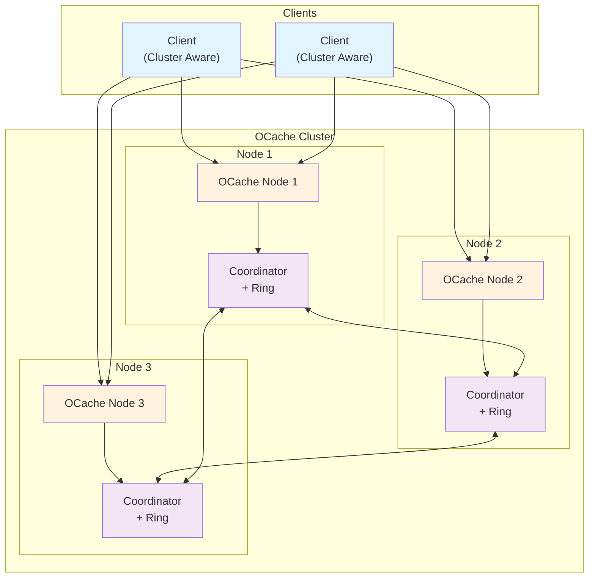
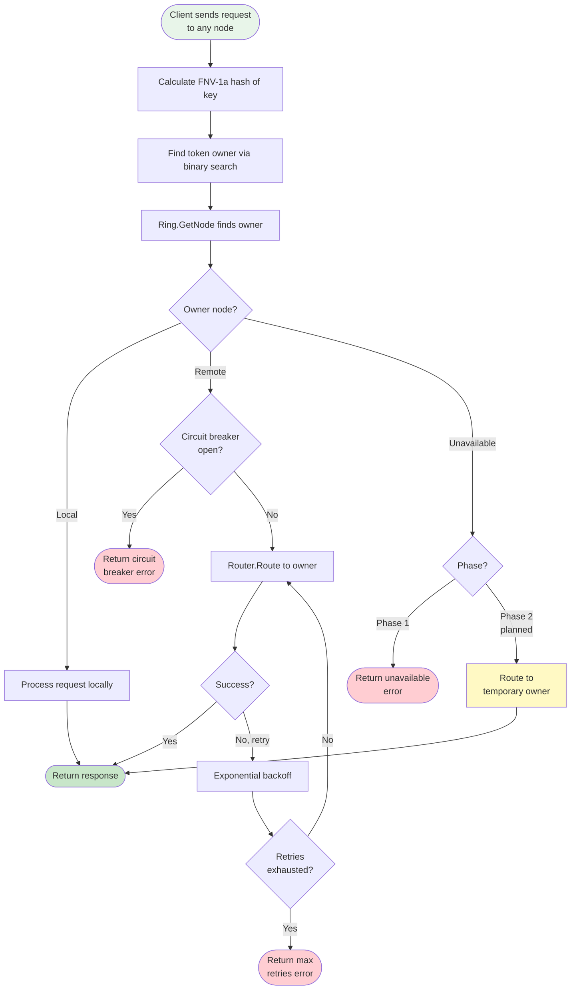
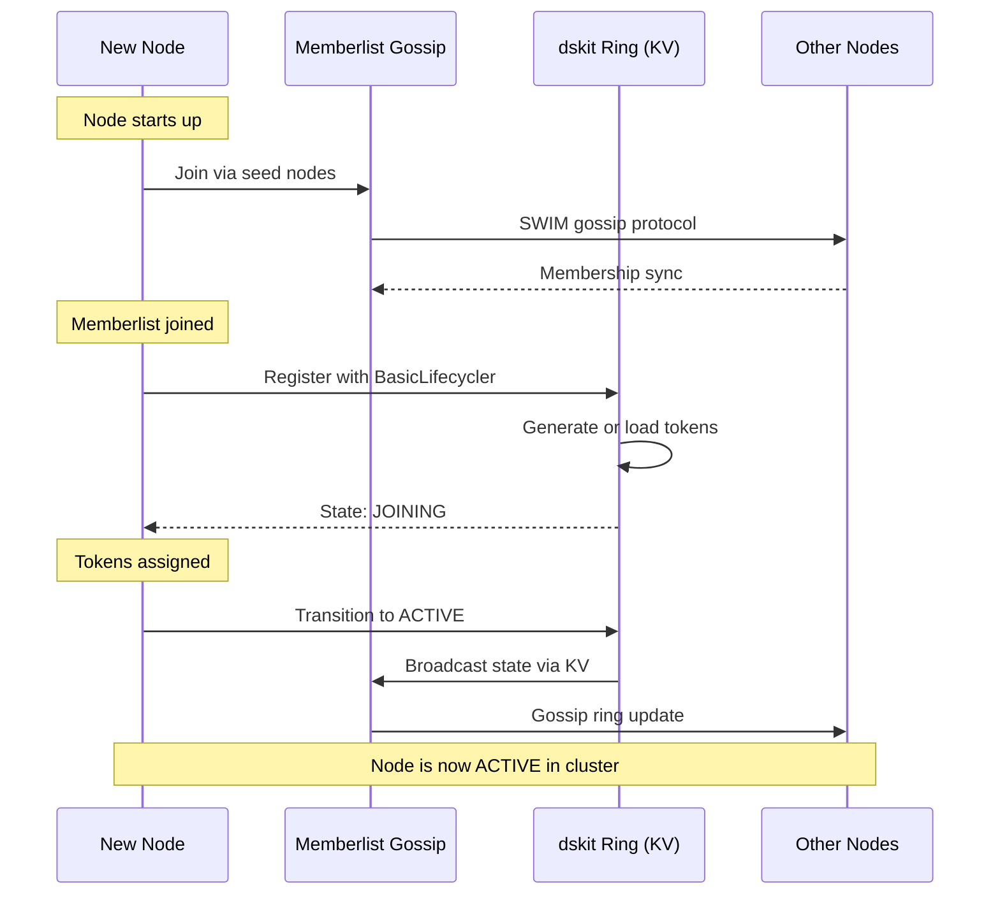
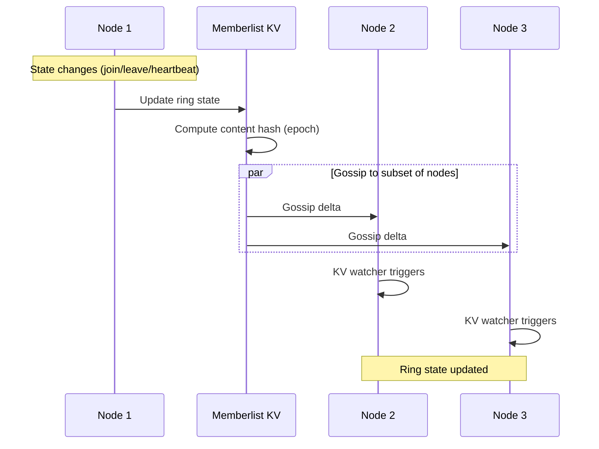
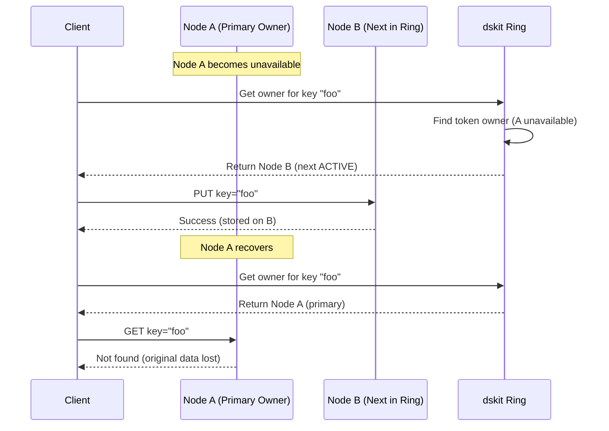
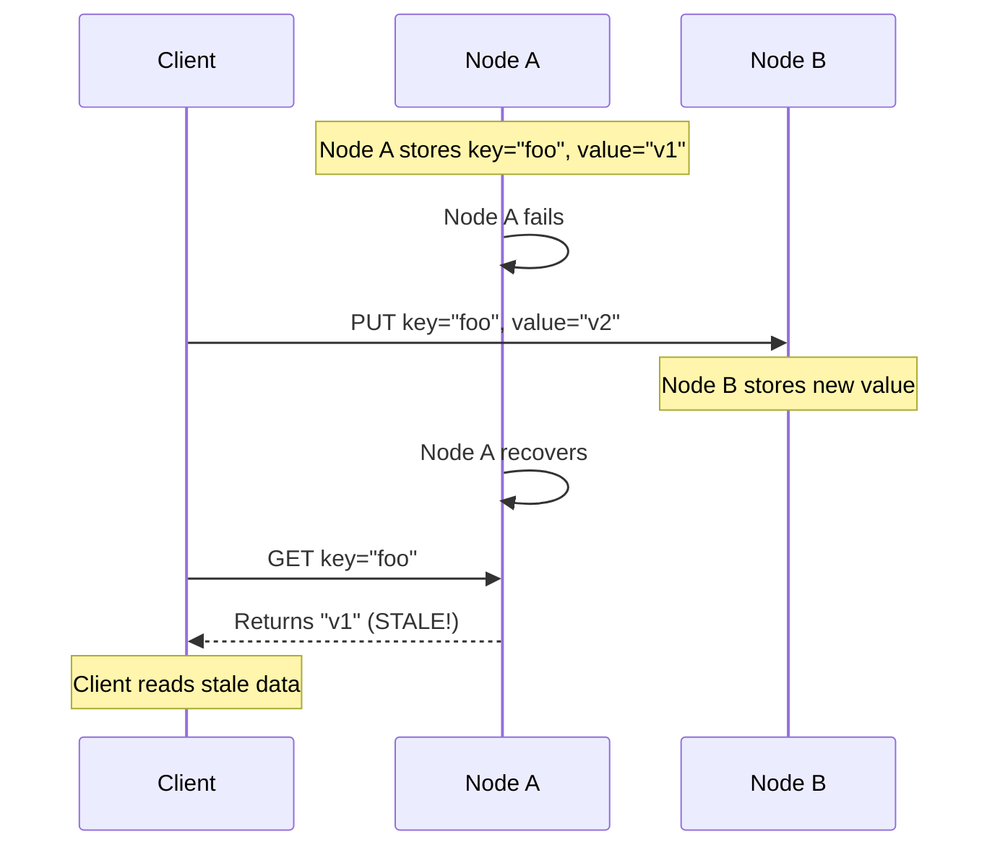

# RFC-007: Distributed Sharding and High Availability

**RFC Number**: 007
**Status**: Implemented (Phase 1)
**Author(s)**: Ovais Tariq
**Created**: 2025-08-20
**Last Updated**: 2026-01-13

## 1. Abstract

This RFC describes the design and implementation of a distributed sharding system for OCache that enables horizontal scaling across multiple nodes. The system uses consistent hashing for data distribution, provides high availability through temporary ownership transfer (without full replication), and implements efficient failure detection and recovery mechanisms.

## 2. Motivation

### 2.1 Problem Statement

OCache currently operates as a single-node cache service. This presents several limitations:

- **Scalability**: Limited by single machine resources (CPU, memory, disk)
- **Availability**: Single point of failure
- **Performance**: Cannot distribute load across multiple machines
- **Capacity**: Cannot exceed single machine storage limits

### 2.2 Goals

- Enable horizontal scaling across multiple nodes
- Provide high availability without full data replication
- Minimize data movement during topology changes
- Maintain consistent performance during node failures
- Support graceful node addition and removal
- Enable cluster-aware client with smart routing

### 2.3 Non-Goals

- Full data replication (traditional N-way replication)
- Strong consistency guarantees (eventual consistency is acceptable)
- Cross-datacenter replication
- Automatic data rebalancing on node addition

## 3. Design Overview

### 3.1 Core Principles

1. **No Data Replication**: Achieve HA through temporary ownership transfer during failures
2. **Minimal Data Movement**: Only transfer changed keys (deltas) during recovery
3. **Consistent Routing**: Use consistent hashing with virtual nodes for even distribution
4. **Graceful Degradation**: Maintain availability during partial failures
5. **Simple Operations**: Easy to understand and operate

### 3.2 High-Level Architecture



### 3.3 Key Components

1. **Consistent Hash Ring**: Determines data ownership using Grafana dskit ring with memberlist gossip
2. **Coordinator**: Manages membership via dskit BasicLifecycler, exposes ClusterService gRPC interface
3. **Router**: Handles request forwarding with retries, circuit breaking, and connection pooling
4. **Memberlist Gossip**: SWIM-based gossip protocol for cluster membership and state propagation
5. **Node Discovery**: DNS-based discovery for seed node resolution (supports Kubernetes headless services)
6. **Cluster Client**: Client-side routing with TokenRing that receives token assignments from server
7. **Error Handling**: Structured error types with retryable/non-retryable classification

## 4. Detailed Design

### 4.1 Consistent Hashing

#### Server-Side (dskit Ring)

- Uses Grafana dskit ring for production-grade consistent hashing
- Token-based ownership with 512 tokens per instance (DefaultNumTokens)
- FNV-1a (32-bit) hash algorithm for dskit compatibility
- Replication factor: 1 (no data replication in Phase 1)
- Token persistence for stable ownership across restarts (stored in `<disk>/coordinator/ring-tokens`)
- Ring state distributed via memberlist gossip protocol

#### Client-Side (TokenRing)

- Custom `TokenRing` implementation (`client/tokenring.go`)
- Receives token assignments from server via `GetClusterTopology` RPC
- Uses same FNV-1a 32-bit hash for routing consistency
- Binary search for O(log n) lookups
- Lock-free reads via atomic pointer swapping

### 4.2 Request Routing



#### Router Configuration

- **Connection Timeout**: 5 seconds
- **Max Message Size**: 128MB (send and receive)
- **Max Retries**: 3 attempts
- **Initial Retry Backoff**: 100ms
- **Max Retry Backoff**: 5 seconds
- **Keepalive Time**: 30 seconds
- **Keepalive Timeout**: 10 seconds
- **Circuit Breaker Threshold**: 5 consecutive failures
- **Circuit Breaker Timeout**: 30 seconds

### 4.3 Cluster Membership

The cluster uses Grafana dskit ring with memberlist gossip for membership management. This provides production-grade features:

- Gossip-based membership (SWIM protocol via HashiCorp memberlist)
- Automatic failure detection and recovery
- Token persistence for stable ownership across restarts
- Well-tested, production-hardened implementation

#### 4.3.1 Join Protocol



#### 4.3.2 Instance Lifecycle States

dskit BasicLifecycler manages instance state transitions:

- **JOINING**: Instance is starting up, tokens assigned but not yet serving
- **ACTIVE**: Instance is healthy and serving requests
- **LEAVING**: Instance is gracefully shutting down (via AnnounceLeaving)
- **LEFT**: Instance has departed the cluster

#### 4.3.3 Ring Heartbeats

- **Heartbeat Period**: 500ms (DefaultHeartbeatPeriod)
- **Heartbeat Timeout**: 60s minimum (MinHeartbeatTimeout)
- Ring heartbeats update instance state in the KV store
- Other nodes receive updates via memberlist gossip (not direct peer-to-peer)

#### 4.3.4 Seed Discovery

- **DNS Provider**: Resolves seed addresses at startup (supports Kubernetes headless services)
- Seed nodes are used for initial memberlist join
- After joining, membership is maintained via gossip (no periodic DNS refresh needed)

#### 4.3.5 Graceful Node Departure

When a node receives SIGINT/SIGTERM:

1. **AnnounceLeaving**: Transitions to LEAVING state via BasicLifecycler (10s timeout)
2. **Gossip Propagation**: State change propagates via memberlist (~500ms)
3. **Stop**: Ring services shut down gracefully
4. **Unregister**: Instance is removed from ring (if UnregisterOnShutdown=true)

### 4.4 Cluster State Synchronization

The cluster uses memberlist gossip for state synchronization. This is a proven approach used by Consul, Nomad, and other production systems.

#### 4.4.1 Gossip Protocol (Memberlist)

Ring state is stored in a distributed KV backed by memberlist:

| Component           | Purpose                                | Configuration                     |
| ------------------- | -------------------------------------- | --------------------------------- |
| **Gossip Messages** | Propagate state changes between nodes  | 200ms interval, 3 nodes per cycle |
| **Push/Pull Sync**  | Full state reconciliation              | Every 30 seconds                  |
| **Ring Heartbeats** | Update instance liveness in KV         | Every 500ms                       |
| **KV Watcher**      | Immediate notification of ring changes | Event-driven                      |

#### 4.4.2 Gossip Configuration

- **Gossip Interval**: 200ms (Time between gossip messages)
- **Gossip Nodes**: 3 (Nodes to gossip to per interval)
- **Push/Pull Interval**: 30 seconds (Full state sync interval)
- **Leave Timeout**: 5 seconds (Graceful departure timeout)
- **Retransmit Mult**: 4 (Retransmission multiplier for reliability)
- **Stream Timeout**: 10 seconds (Connection/read/write timeout)

#### 4.4.3 Ring State Propagation



#### 4.4.4 KV Watcher

Each node runs a KV watcher that monitors ring state changes:

Benefits:

- Immediate notification of membership changes
- No polling overhead
- Efficient delta-based updates

#### 4.4.5 Epoch Tracking

The epoch is a content-addressable hash of the ring state:

- Nodes with identical ring views have identical epochs
- Clients use epoch to detect stale topology
- Epoch changes on any membership modification

#### 4.4.6 Failure Detection

Memberlist handles failure detection automatically:

- **Probe Interval**: Configurable via memberlist
- **Suspicion Multiplier**: Handles network delays
- **Heartbeat Timeout**: 60s (MinHeartbeatTimeout) before marking unhealthy
- **Automatic Recovery**: Failed nodes are automatically detected and removed

#### 4.4.7 Synchronization Properties

**✅ Eventually Consistent:**

- SWIM gossip protocol guarantees convergence
- Typical convergence time: < 1 second for small clusters
- Logarithmic scaling with cluster size

**✅ Partition Tolerant:**

- Gossip continues to function during partial network failures
- Automatic re-sync when connectivity restored

**✅ Production Tested:**

- Same protocol used by Consul, Nomad, Serf
- Battle-tested at scale

### 4.5 gRPC Service API

The cluster exposes a minimal gRPC API. Membership is handled internally via memberlist gossip.

```protobuf
service ClusterService {
  // GetClusterState returns current cluster membership
  rpc GetClusterState(Empty) returns (ClusterState);

  // GetClusterTopology returns full topology with token assignments
  rpc GetClusterTopology(Empty) returns (ClusterTopology);
}

message ClusterTopology {
  uint64 epoch = 1;                    // Ring version for cache invalidation
  repeated NodeInfo nodes = 2;          // All cluster members
  RingConfig ring_config = 3;           // Token assignments for client routing
}

message RingConfig {
  int32 replication_factor = 1;         // Data replication (1 = no replication)
  repeated NodeTokens node_tokens = 2;  // Token assignments per node
}

message NodeTokens {
  string node_id = 1;
  repeated uint32 tokens = 2;           // Sorted list of tokens owned by this node
}
```

### 4.6 Client Integration

#### ClusterClient Features

- Custom `TokenRing` for client-side routing
- Receives token assignments from server via `GetClusterTopology` RPC
- Routes requests directly to owner nodes using FNV-1a hash
- Handles retries and failover with exponential backoff
- Refreshes topology periodically (configurable interval)
- Supports topology epoch tracking for cache invalidation
- Round-robin fallback when routing information unavailable

#### Client Protocol

1. Connect to seed nodes to fetch initial topology via `GetClusterTopology`
2. Build local TokenRing from token assignments (sorted array of tokens)
3. For each request: hash key with FNV-1a, binary search for owning token
4. Route requests directly to the owner node
5. Refresh topology on epoch mismatch or routing errors

### 4.7 Data Consistency Model

#### 4.7.1 Phase 1: Best Effort

- No replication
- Data loss on node failure
- Eventually consistent after recovery
- Possible stale reads after node recovery (see Section 4.8.4)

#### 4.7.2 Phase 2: Hinted Handoff (Planned)

- Temporary ownership transfer during failures
- Hint storage for mutations during downtime
- Replay protocol on recovery
- Bounded inconsistency window

### 4.8 Token Reassignment and Failure Handling

This section describes how the cluster handles token ownership when nodes become unavailable and the implications for data availability and consistency.

#### 4.8.1 Token Redistribution on Node Failure

When a node becomes unavailable, tokens are **not explicitly reassigned** to other nodes. Instead, the dskit ring's consistent hashing naturally routes requests to the next available node:

- For any key hash, the ring finds the first token >= hash value owned by an ACTIVE node
- If the primary owner is unavailable, requests route to the next ACTIVE node in the token ring
- Write availability is maintained for all keys (no write downtime)
- Keys stored on the unavailable node return "not found" until the node recovers
- No data migration occurs - the temporary owner only handles new writes



#### 4.8.2 Failure Detection and State Transitions

**Failure Detection Timing:**

| Detection Method | Timeout | Description |
|------------------|---------|-------------|
| Heartbeat Timeout | 60 seconds | Node marked unhealthy after missing heartbeats |
| Graceful Shutdown | < 1 second | Node broadcasts LEAVING state via gossip |
| Memberlist Suspicion | Configurable | SWIM protocol handles network delays |

**State Transitions:**

- **Crash/Force Kill**: ACTIVE → (heartbeat timeout) → DOWN/Unhealthy
- **Graceful Shutdown**: ACTIVE → LEAVING → LEFT
- **Recovery**: DOWN → JOINING → ACTIVE

When the ring state changes, the epoch is recomputed and propagated via gossip. Clients detect epoch mismatches and refresh their topology.

#### 4.8.3 Client-Side Routing During Failures

When a node fails, clients handle routing as follows:

1. **Epoch Mismatch Detection**: Server responds with new epoch, client detects mismatch
2. **Topology Refresh**: Client fetches updated topology (rate-limited to 100ms minimum)
3. **TokenRing Update**: Client rebuilds local token ring with only ACTIVE nodes
4. **Atomic Switchover**: Lock-free reads via atomic pointer swap

During the transition window (before topology refresh):
- Requests may still route to the failed node
- Router retries with exponential backoff (100ms initial, 5s max)
- Circuit breaker opens after 5 consecutive failures (30s timeout)
- After circuit breaker opens, requests fail fast

#### 4.8.4 Stale Read Scenarios

**Critical: Phase 1 has no protection against stale reads.**

When a node fails and later recovers:



**Stale Read Conditions:**

1. Node A fails while owning key K with value V1
2. During A's downtime, client writes K=V2 to Node B (next in ring)
3. Node A recovers and rejoins with original tokens
4. Client reads K from A and receives V1 (stale)

**Implications:**

- No automatic data reconciliation between nodes
- Clients may read outdated data from recovered nodes
- Stale data persists until the key is explicitly overwritten
- Applications requiring strong consistency must implement their own versioning

#### 4.8.5 Recovery Behavior

When a failed node comes back online:

1. **Rejoins Ring**: Node registers with its persisted tokens (from disk)
2. **State Transition**: JOINING → ACTIVE (after heartbeat)
3. **Original Data**: Node retains data from before failure
4. **No Sync**: No automatic data synchronization with other nodes
5. **Token Ownership**: Resumes ownership of its original tokens

**Data State After Recovery:**

| Scenario | Data on Recovered Node | Data on Temporary Owner |
|----------|----------------------|------------------------|
| Key never written during failure | Original (current) | N/A |
| Key written during failure | Original (STALE) | New value (current) |
| Key deleted during failure | Original (STALE) | Not found |

**Mitigation Strategies (Application-Level):**

- Use short TTLs to limit stale data lifetime
- Implement version vectors or timestamps in values
- Add read-repair logic in application layer
- Use external coordination for critical data

## 5. Performance Considerations

### 5.1 Latency Impact

- **Local requests**: No additional latency
- **Remote requests**: +1 network hop (~1-2ms in same DC)
- **Failed node requests**: +retry backoff (100ms initial)

### 5.2 Throughput

- **Horizontal scaling**: Near-linear with node count
- **Connection pooling**: Reduces connection overhead
- **Circuit breaker**: Prevents cascade failures

## 6. Operational Considerations

### 6.1 Failure Scenarios

| Scenario               | Impact                            | Recovery                                 |
| ---------------------- | --------------------------------- | ---------------------------------------- |
| Graceful shutdown      | Node transitions to LEAVING       | Detected in < 1s (gossip propagation)    |
| Crash/force kill       | Keys on failed node unavailable   | Detected via heartbeat timeout (60s)     |
| Single node failure    | Keys on failed node unavailable   | Automatic detection via memberlist       |
| Network partition      | Split brain possible              | Memberlist handles with suspicion states |
| Cascading failures     | Circuit breakers prevent overload | Automatic recovery when nodes return     |
| DNS resolution failure | New nodes cannot join             | Existing gossip cluster continues        |
| Connection failure     | Retries with exponential backoff  | Circuit breaker opens after threshold    |
| Temporary unavailability | Writes route to next node in ring | Write availability maintained            |
| Node recovery after failure | Possible stale reads         | No automatic reconciliation; app-level mitigation |

### 6.2 Error Types

#### Non-Retryable Errors

- `ErrNodeNotFound`: Target node doesn't exist in ring
- `ErrCircuitBreakerOpen`: Circuit breaker is open for a node
- `ErrLocalRouting`: Attempt to route to local node
- `ErrMaxRetriesExceeded`: All retry attempts exhausted

#### Retryable Errors

- `ErrConnectionFailed`: Failed to establish connection
- gRPC `Unavailable`, `DeadlineExceeded`, `Canceled`, `Aborted` codes

## 7. Security Considerations

### 7.1 Current State

- No authentication between nodes
- No encryption for inter-node communication
- Trust-based cluster membership

## 8. References

- [Amazon Dynamo Paper](https://www.allthingsdistributed.com/files/amazon-dynamo-sosp2007.pdf)
- [Consistent Hashing with Bounded Loads](https://ai.googleblog.com/2017/04/consistent-hashing-with-bounded-loads.html)
- [Grafana dskit](https://github.com/grafana/dskit) - Production-grade distributed systems toolkit
- [HashiCorp memberlist](https://github.com/hashicorp/memberlist) - SWIM-based gossip protocol
- [SWIM Protocol Paper](https://www.cs.cornell.edu/projects/Quicksilver/public_pdfs/SWIM.pdf)
